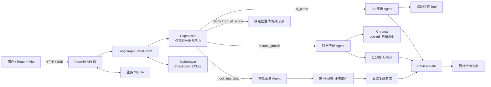
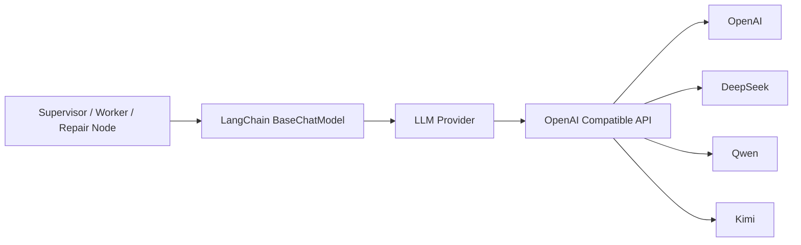
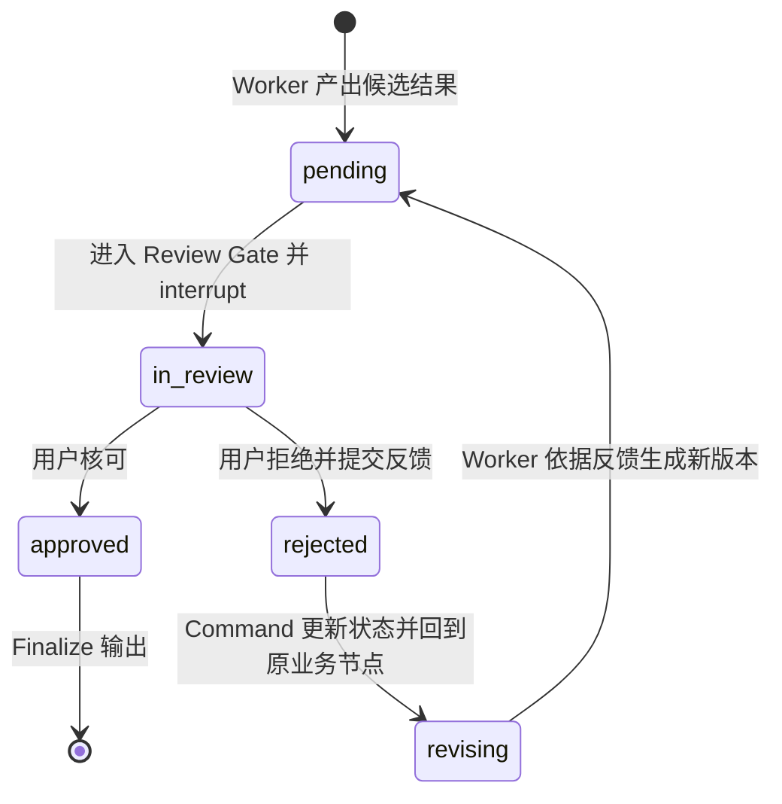
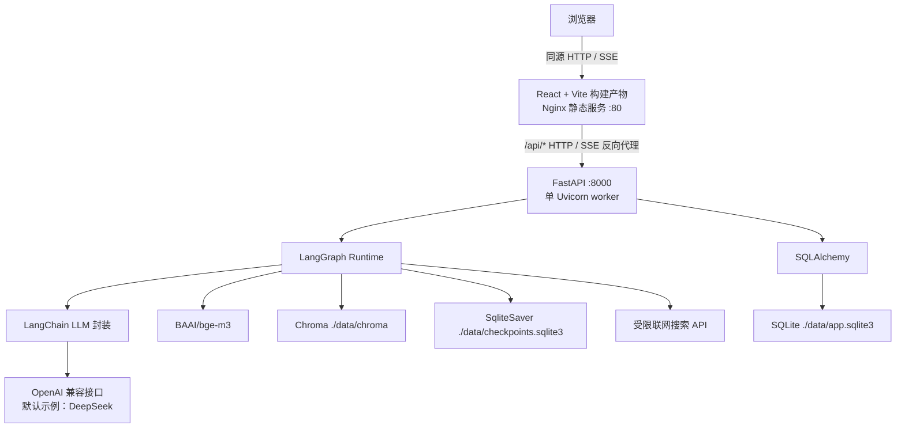

# 求职多智能体辅助系统架构设计规划书

> 文档性质：以正式架构设计为主体；四周计划仅说明技术接入顺序，不替代模块验收标准。  
> 目标读者：项目作者、后续维护者、技术面试官。  
> 核心证明点：能够围绕职责边界、显式状态、可恢复执行、人工介入和可验证评测设计 Agent 系统，而不是串联若干次 LLM 调用。

## 1. 项目背景与目标

### 1.1 项目背景

本项目是一个面向技术岗位求职流程的多智能体辅助系统，覆盖三类高频任务：

1. 将非结构化职位描述（JD）解析为技能要求、岗位职责和面试重点。
2. 将 JD 与用户的个人简历知识库进行基于证据的匹配，输出量化分数、优势、差距和改进建议。
3. 根据目标岗位进行多轮模拟面试，逐题评估回答，并在面试结束后生成完整复盘报告。

项目的首要价值不是替代招聘决策，也不是追求 Agent 数量，而是展示以下工程能力：

- 用 Supervisor-Worker 模式拆分语义职责，而不是构造一个提示词不断膨胀的单 Agent。
- 用 LangGraph 显式描述路由、循环、暂停、恢复和错误分支。
- 用隔离状态、Checkpoint、结构化输出和可观测字段约束 LLM 的不确定性。
- 用 Human-in-the-loop（HITL）处理需要用户补充、确认或否决的决策点。
- 用轻量、可复现的对比实验验证多 Agent 设计是否真的带来收益。

### 1.2 目标与非目标

#### 目标

- 对输入请求进行语义路由，并稳定进入 3 个 Worker Agent 中的正确节点。
- 所有核心业务输出均满足确定的 Pydantic/JSON Schema。
- 简历匹配结论必须能追溯到简历知识库中的证据片段。
- 模拟面试支持多轮追问、逐题评价、中途补充上下文以及终局复盘。
- 任意需要人工介入的执行都可以通过同一 `thread_id` 从 Checkpoint 恢复，而不是从头运行。
- 格式错误、模型超时、检索无结果等异常不会导致 Graph 无记录地终止。

#### 非目标

- 不自动投递简历，不接入招聘网站账号，不代表用户与招聘方通信。
- 不训练或微调基础模型；项目重点是编排、状态和评测。
- 不设计第 4 个 Worker Agent。联网检索是 JD 解析 Agent 的 Tool，复盘生成是模拟面试 Agent 的内部阶段。
- 不在首版支持多人协作、租户隔离、水平扩容和高并发写入。
- 匹配分数是求职准备参考，不宣称等价于招聘方录用概率。

### 1.3 已确定的技术选型

| 模块 | 技术 |
|---|---|
| Workflow | LangGraph |
| LLM封装 | LangChain |
| LLM | OpenAI 兼容接口（支持切换模型，如 DeepSeek） |
| API | FastAPI |
| 前端 | React + Vite |
| ORM | SQLAlchemy |
| 关系数据库 | SQLite |
| 向量数据库 | Chroma |
| Embedding | `BAAI/bge-m3`（项目唯一模型，不支持运行时切换） |
| 状态持久化 | LangGraph Checkpointer（`SqliteSaver`，与关系数据库对齐） |
| 容器化 | Docker + Docker Compose |
| 版本管理 | Git + GitHub |

Embedding 固定使用 `BAAI/bge-m3`。项目不设计可插拔 Embedding，不支持多个 Embedding 模型切换，所有简历 chunk 与查询向量均由同一模型生成。原因是更换 Embedding 会改变向量维度与语义空间，必须完整重建 Chroma collection；对四周个人项目而言，这种灵活性只会增加配置分支、索引版本和排错成本。collection metadata 固定保存 `embedding_model=BAAI/bge-m3` 与向量维度，启动时发现不一致必须拒绝查询并要求重建索引。

Chroma 而非 FAISS 的理由是：Chroma `PersistentClient` 可直接持久化、支持 metadata filter，且与 LangChain 集成成熟；FAISS 更偏底层索引库，文档 metadata、增量更新和持久化需要额外封装。SQLite 而非 Postgres 的理由是：本项目首版为单用户、低写并发个人项目，SQLite 已能覆盖业务数据、实验记录和审计需求；Postgres 的服务运维和连接管理成本在当前规模下没有对应收益。

SQLite 的适用边界必须明确：生产演示使用单实例 FastAPI、单个 Uvicorn worker，并启用 WAL 和 `busy_timeout`。如果未来需要多个 API 实例共享状态，SQLite 与 `SqliteSaver` 必须一起迁移为 Postgres 与 `PostgresSaver`，不能只替换其中一个。

### 1.4 本章验收标准

- 检查配置与依赖声明，必须能定位到 LangGraph、LangChain、FastAPI、React + Vite、SQLAlchemy、SQLite、Chroma `PersistentClient`、`SqliteSaver`、`BAAI/bge-m3`、Docker Compose 和 Git/GitHub；不得存在仅写“向量库”“数据库”或“前端框架”的未决配置。
- 关闭外部数据库服务后，单机仍应能启动全部核心功能；删除 Chroma 持久化目录后只影响 RAG 索引，不应破坏 SQLite 中的业务记录与 Checkpoint。
- 以两个并发请求做冒烟测试时，系统不得出现 SQLite `database is locked`；若改为多 Uvicorn worker，部署检查必须明确失败并提示该模式不受首版支持。
- Chroma collection metadata 中的 embedding_model 不是 BAAI/bge-m3 → readiness 必须失败并要求重建索引，不得自动切换模型或继续查询。

## 2. 整体架构图与设计原则

### 2.1 逻辑架构



图中的 Review Gate、低分确认 Gate、澄清节点、错误处理节点和最终产物节点都是确定性控制节点，不具备自主规划能力，因此不计入 Worker Agent 数量。系统只有 3 个 Worker Agent。

### 2.2 核心设计原则

1. **Supervisor 只路由，不做业务。** Supervisor 只输出意图、目标节点、置信度和理由，不解析 JD、不检索简历、不生成面试题。
2. **路由由 LLM Router + `conditional_edges` 完成。** 禁止用关键词 `if-else` 判定业务意图；边映射只负责把 Router 已输出的枚举值映射到节点。
3. **Agent 负责开放式决策，Tool 负责窄而确定的能力。** 搜索、向量检索、分数计算、Schema 校验均不应伪装为独立 Agent。
4. **状态字段按所有权隔离。** 每个 Worker 只写自己的业务字段，共享字段仅用于调度、审计、错误和摘要。
5. **任何结论都可验证。** 匹配结果引用证据，路由保留置信度，错误进入日志，人工决策保留审计记录。
6. **暂停点必须可恢复。** 所有 HITL 节点在暂停前已持久化状态，恢复时只消费 `Command(resume=...)`，不依赖进程内变量。
7. **先约束输出，再重试模型。** 结构化输出优先使用模型的 schema/function calling；解析失败后才进入带反馈的重试。

### 2.3 关键替代方案权衡

#### 为什么不是单 Agent + 所有工具

单 Agent 可以减少节点数量，但其系统提示词会同时包含 JD 抽取、RAG 匹配、面试节奏、评分规则和复盘格式。这样做会产生三个可观测问题：工具选择空间扩大、不同任务的上下文相互污染、单个提示词修改影响全部功能。3 个 Worker 的拆分依据是稳定的业务职责，而不是为了展示“多 Agent”。

#### 为什么不是顺序流水线

JD 解析、简历匹配和模拟面试既可以单独使用，也可以串联使用。固定流水线会迫使每次请求都执行不需要的步骤。Supervisor 路由允许单任务直接进入目标 Worker；需要组合任务时，则通过状态中已有的 `jd_parsed` 作为后续 Worker 输入，而不是重新解析。

#### 为什么不是 Worker 之间自由对话

自由对话会增加不可控调用次数，并使“谁拥有最终结论”变得模糊。本项目通过共享 State 传递结构化产物，由 Graph 决定下一节点；Worker 之间不直接发送自然语言消息。

### 2.4 Model Provider

系统所有聊天模型调用统一经过 Model Provider 层。Provider 的职责是把配置转换为 LangChain `BaseChatModel` 实例，并统一设置模型名、Base URL、API Key、超时、重试和 structured output 能力；Supervisor、Worker 和错误修复节点只依赖 LangChain 抽象，不直接依赖任何厂商 SDK。



配置项固定为：

```dotenv
MODEL_PROVIDER=openai_compatible
BASE_URL=https://api.deepseek.com/v1
MODEL_NAME=deepseek-chat
API_KEY=<由 secret 注入>
```

Provider 工厂只在应用启动时执行一次：

```python
from langchain_core.language_models.chat_models import BaseChatModel
from langchain_openai import ChatOpenAI

def build_chat_model(settings: ModelSettings) -> BaseChatModel:
    if settings.model_provider != "openai_compatible":
        raise ValueError("Unsupported MODEL_PROVIDER")

    return ChatOpenAI(
        base_url=settings.base_url,
        model=settings.model_name,
        api_key=settings.api_key,
        timeout=30,
        max_retries=0,  # 重试由节点级错误恢复策略统一管理
    )
```

这里的单个 `if` 是 Provider 配置校验，不是 Supervisor 业务路由。Agent 节点通过依赖注入接收 `BaseChatModel`，不得在业务代码中 `import openai`、DeepSeek/Qwen/Kimi SDK，也不得自行读取 API Key。未来替换模型只修改配置或 Provider 实现，不修改 State、Graph 和 Agent Schema。

Model Provider 只抽象聊天模型。Embedding 已固定为 `BAAI/bge-m3`，不随 `MODEL_NAME` 切换，避免 Chroma 向量空间发生变化。

#### 验收标准

- 将 `BASE_URL` 和 `MODEL_NAME` 从 DeepSeek 改为另一个提供 OpenAI Compatible API 的服务 → Supervisor 和三个 Worker 的业务代码无修改，Schema 测试仍通过。
- 代码扫描 Agent 目录 → 不得出现具体厂商 SDK import、硬编码 Base URL 或 API Key。
- 缺少 `MODEL_PROVIDER`、`BASE_URL`、`MODEL_NAME` 或 `API_KEY` → 应用启动立即失败并指出具体缺失项，不得在首个模型请求时才报错。
- Provider 返回不支持 structured output 的模型 → readiness 失败或启动自检明确报告 `MODEL_CAPABILITY_UNSUPPORTED`。

### 2.5 统一 Schema 层

所有 Agent 输入输出、共享 State、HITL 命令和 Review 结构统一放在 `schemas/` 目录。Agent 节点只导入并返回 Schema 对象或可由 Schema 验证的字典，不在函数内部临时约定 JSON 字段。

```text
schemas/
├── state.py       # JobAssistantState、ExecutionEvent、ErrorEntry
├── jd.py          # JDParseInput、JDParsed、SkillRequirement
├── resume.py      # MatchResult、MatchItem、EvidenceRef
├── interview.py   # InterviewState、QuestionRecord、InterviewReport
└── review.py      # ReviewStatus、ReviewCommand、InterruptPayload
```

职责划分如下：

- `state.py` 使用 TypedDict 和 reducer annotation 描述 LangGraph 全局状态。
- 业务输入输出使用 Pydantic `BaseModel`，负责类型、枚举、范围和字段级校验。
- `review.py` 统一定义 `interrupt` payload 和 `Command(resume=...)` 的输入结构，前后端共享同一份 JSON Schema。
- API 层可以从 Pydantic 自动生成 OpenAPI；React 类型通过 OpenAPI 生成或手工保持一一对应。
- Schema 发生不兼容修改时更新 `schema_version`，并与 `graph_version` 一起写入 Checkpoint metadata。

禁止以下做法：

- Agent 通过字符串拼接构造 JSON。
- 不同节点分别定义同名但含义不同的字段。
- 用 `dict[str, Any]` 绕过已经定义的业务 Schema。
- 前端自行猜测 interrupt payload 字段。

#### 验收标准

- 删除任一必填字段或传入非法枚举 → 对应 Pydantic Schema 必须在进入下游节点前拒绝输入，并产生字段级错误。
- 全仓库搜索 Agent 节点 → 核心产物必须引用 `schemas.jd`、`schemas.resume`、`schemas.interview` 或 `schemas.review`，不得出现重复的临时模型定义。
- 从 FastAPI OpenAPI 获取 interrupt Schema → React 表单使用的 action 与字段必须一致；非法 action 在 API 层返回 422，不进入 Graph。
- Checkpoint 中 `schema_version` 不兼容 → 返回 `CHECKPOINT_VERSION_MISMATCH`，不得使用宽松字典强行恢复。

### 2.6 本章验收标准


- 输入“分析下面这份 Java 后端 JD” → Supervisor 输出 `route=jd_parse` → 仅 JD 解析 Agent 被调用，简历检索和面试节点调用次数必须为 0。
- 输入“根据我的简历评估这个岗位” → Supervisor 输出 `route=resume_match` → 若状态中缺少结构化 JD，简历匹配 Agent可调用其内部前置解析函数，但不得绕回 Supervisor 或生成新的 Worker。
- 在测试中替换 Router 输出为非法枚举值 → Schema 校验必须失败并进入路由重试/错误分支，Graph 不得通过默认 `if-else` 猜测目标节点。
- 检查 LangGraph 构图代码，业务路由必须使用 `add_conditional_edges`；不得存在按“简历”“JD”“面试”等关键词判断节点的硬编码分支。

## 3. 各 Agent 详细设计

### 3.1 Supervisor 节点

#### 职责边界

Supervisor 是 LLM Router，不是业务 Agent。它只读取当前用户输入、必要的会话摘要和已有产物标志，输出路由决策。

允许：

- 判定请求属于 JD 解析、简历匹配、模拟面试、需要澄清或超出范围。
- 对“一次请求包含多个任务”的情况输出一个有序 `task_queue`，Graph 每次只分发一个任务。
- 给出路由置信度和简短理由，用于日志与低置信度澄清。

禁止：

- 生成任何 JD 字段、匹配分数、面试题或复盘内容。
- 调用联网搜索、Chroma 或简历数据访问工具。
- 基于关键词 `if-else` 决定路由。

#### 输入输出 Schema

```python
from typing import Literal
from pydantic import BaseModel, Field

class RouterDecision(BaseModel):
    route: Literal[
        "jd_parse",
        "resume_match",
        "mock_interview",
        "clarify",
        "out_of_scope",
    ]
    confidence: float = Field(ge=0.0, le=1.0)
    reason: str = Field(min_length=1, max_length=200)
    task_queue: list[Literal[
        "jd_parse", "resume_match", "mock_interview"
    ]] = Field(default_factory=list)
```

低于 `0.70` 的路由结果不直接执行业务，进入确定性的 `clarify_node`，要求用户从当前候选意图中补充信息。`clarify_node` 不是 Agent，不做业务推理。

#### 验收标准

- 输入“帮我提炼这份岗位要求” → `route=jd_parse`，`confidence >= 0.70`，输出严格符合 `RouterDecision`。
- 输入“这份岗位我合适吗？顺便按它面试我” → `task_queue` 必须按 `resume_match, mock_interview` 返回；完成匹配后再进入面试，不得并行覆盖状态。
- 输入“帮我写一首诗” → `route=out_of_scope`，三个 Worker 调用次数均为 0。
- 输入空文本或仅空白符 → 不调用 Router LLM，确定性校验写入 `error_log`，返回可修正提示，Graph 不崩溃。
- 输入超过 30,000 字符 → API 层拒绝或截断前必须返回明确错误码 `INPUT_TOO_LONG`，不得静默截断后误路由。

### 3.2 JD 解析 Agent

#### 职责

- 从 JD 原文抽取岗位名称、级别、职责、必备技能、加分技能、经验要求、教育要求和面试重点。
- 标记“原文明确要求”与“根据职责合理推断”的差异，禁止将推断伪装成原文事实。
- 当 JD 中存在明确公司名且用户允许联网时，决定是否调用公司背景搜索 Tool，补充与岗位准备直接相关的公开信息。

#### 输入 Schema

```python
class JDParseInput(BaseModel):
    jd_text: str = Field(min_length=20, max_length=30000)
    allow_web_search: bool = False
    language: Literal["zh-CN", "en-US", "auto"] = "auto"
```

#### 输出 Schema

```python
class SkillRequirement(BaseModel):
    name: str
    category: Literal["language", "framework", "database", "cloud", "engineering", "domain", "soft_skill"]
    priority: Literal["must", "preferred", "inferred"]
    evidence: str

class JDParsed(BaseModel):
    job_title: str
    seniority: Literal["intern", "junior", "mid", "senior", "lead", "unknown"]
    company_name: str | None
    responsibilities: list[str]
    skills: list[SkillRequirement]
    experience_requirements: list[str]
    education_requirements: list[str]
    interview_focus: list[str]
    company_context: list[str]
    ambiguities: list[str]
    source_language: str
```

结果只写入 `state["jd_parsed"]`。`evidence` 必须是 JD 原文短句或可定位片段；`priority=inferred` 的项目必须说明推断依据。

#### 可调用工具

| Tool | 用途 | 输入 | 输出约束 |
|---|---|---|---|
| `search_company_background` | 补充公司主营业务、近期公开技术方向和岗位相关背景 | 公司名、限定查询词、时间范围 | 最多 5 条结果，每条含标题、URL、摘要、抓取时间 |
| `normalize_skill_name` | 将 `PostgreSQL/Postgres` 等同义词归一 | 单个技能文本 | 规范名、别名、类别 |
| `validate_jd_schema` | Pydantic 校验 | 候选 JSON | 成功对象或字段级错误 |

联网搜索只在 `allow_web_search=true` 且识别出公司名时可调用；搜索内容写入 `company_context`，不得改变 JD 原文证据字段。

#### 验收标准

- 输入包含“熟悉 Python、FastAPI，3 年以上后端经验”的 JD → `skills` 中必须存在 Python、FastAPI 且 `priority=must`，`experience_requirements` 包含 3 年要求，每项均保留原文证据。
- 输入没有公司名 → 不调用 `search_company_background`，`company_name=null`、`company_context=[]`。
- 输入含公司名但 `allow_web_search=false` → 搜索 Tool 调用次数为 0。
- 输入把“了解 Kubernetes 优先”写为加分项 → 不得输出为 `must`。
- 输入长度小于 20 或纯招聘宣传、无岗位要求 → 返回字段级校验/歧义信息并写 `error_log` 或 `ambiguities`，不得伪造技能要求。

### 3.3 简历匹配 Agent

#### 职责

- 读取 `jd_parsed`；若调用入口仅有 JD 原文，则执行同一套 JD 结构化解析组件后再匹配，但不创建额外 Agent。
- 使用 `BAAI/bge-m3` 对查询和简历 chunk 编码，通过 Chroma 检索证据。
- 对必备技能、加分技能、职责经验、年限/教育约束分别评分。
- 输出总分、维度分、优势、差距、建议及证据引用。
- 总分低于 60 时必须进入人工确认 Gate，不得直接生成最终求职建议。

#### RAG 设计

简历入库按语义单元切分，不使用固定字符数粗切：

- `profile`：个人概要，每块 200-400 中文字符。
- `experience`：按公司/岗位/职责条目切分，每块保留公司、时间范围 metadata。
- `project`：按项目切分，技术栈、职责和结果不可拆散。
- `skill`：技能清单按类别切分。
- `education`：每段教育经历单独切分。

Chroma collection 固定为 `resume_chunks`，持久化路径为 `./data/chroma`。metadata 至少包含：

```json
{
  "resume_version": "2026-07-v1",
  "section_type": "project",
  "source_id": "resume-main",
  "chunk_id": "project-003",
  "start_line": 42,
  "end_line": 57
}
```

当前版本的 RAG 检索策略固定为 **Top-K Semantic Retrieval**：

1. 使用唯一 Embedding 模型 `BAAI/bge-m3` 生成查询向量。
2. 在 Chroma 中按 cosine 相似度执行语义检索。
3. 每个 JD 技能/职责查询固定取 `top_k=5`。
4. 检索适配层将 Chroma distance 转换为 `[0, 1]` 的 `relevance_score`。
5. `relevance_score < 0.35` 的片段不作为正向证据。

MVP 不引入 Reranker、Hybrid Search、GraphRAG。原因是个人简历通常少于数百个 chunk，当前主要风险是切分质量、metadata 过滤、证据阈值和引用准确性，而不是大规模召回排序。上述高级检索能力只列入 Future Work；当前实现不得预留多套运行分支或为了“以后可能使用”增加额外接口层。


#### 评分规则

总分为 100 分，采用确定性加权，LLM 只负责基于证据判定单项覆盖等级：

| 维度 | 权重 | 判定方式 |
|---|---:|---|
| 必备技能覆盖 | 40 | 每项按直接证据 1.0、可迁移证据 0.6、弱相关 0.3、无证据 0 计分 |
| 核心职责经历 | 30 | 按职责与项目/经历证据覆盖率计分 |
| 加分技能覆盖 | 10 | 同必备技能，但不反向吞噬必备项分数 |
| 年限与教育等硬约束 | 10 | 明确满足、部分满足、不满足分别为 1、0.5、0 |
| 证据强度与近期性 | 10 | 有量化结果且近 3 年的证据优先；无证据不得靠措辞补分 |

计算公式固定为：

```text
total_score = round(
    must_skill_score * 0.40 +
    responsibility_score * 0.30 +
    preferred_skill_score * 0.10 +
    constraint_score * 0.10 +
    evidence_quality_score * 0.10,
    1
)
```

低分阈值固定为 **60.0**：`total_score < 60.0` 强制人工确认；`total_score == 60.0` 不触发低分 Gate，但仍需经过最终产物核可。

#### 输出 Schema

```python
class EvidenceRef(BaseModel):
    chunk_id: str
    quote: str
    relevance: float = Field(ge=0.0, le=1.0)

class MatchItem(BaseModel):
    requirement: str
    status: Literal["matched", "transferable", "weak", "missing"]
    score: float
    evidence: list[EvidenceRef]
    rationale: str

class MatchResult(BaseModel):
    total_score: float = Field(ge=0.0, le=100.0)
    dimension_scores: dict[str, float]
    matched_items: list[MatchItem]
    strengths: list[str]
    gaps: list[str]
    recommendations: list[str]
    low_score_review_required: bool
    resume_version: str
```

结果只写入 `state["match_result"]`。

#### 验收标准

- 输入 Java 后端 JD，简历包含可定位的 Java/Spring Boot 项目 → 匹配项必须引用对应 `chunk_id` 和原文摘录，不能只给自然语言判断。
- 简历没有 Kubernetes 证据 → Kubernetes 项必须为 `missing` 或至多 `weak`，证据数组不得引用无关 Docker 片段冒充直接匹配。
- 计算得到 `59.9` → `low_score_review_required=true` 并触发 interrupt；计算得到 `60.0` → 该字段为 false，不触发低分 Gate。
- Chroma 返回空结果 → 总分不得高于 10，`gaps` 应覆盖无证据项，`error_log` 记录 `RAG_EMPTY_RESULT`；Graph 仍能进入人工确认。
- 传入不存在的 `resume_version` → 不得回退到其他版本，必须返回 `RESUME_VERSION_NOT_FOUND`。
- 检查运行依赖与检索链路 → MVP 只能存在 BAAI/bge-m3 + Chroma top_k=5 语义检索，不得调用 Reranker、关键词混合检索或 GraphRAG。

### 3.4 模拟面试 Agent

#### 职责与内部阶段

模拟面试 Agent 是一个 Worker，但内部由多个 LangGraph 节点组成同一子图：

1. `interview_plan`：根据 `jd_parsed`、`match_result` 和用户目标生成面试计划。
2. `ask_question`：按计划选择下一题；可依据上一题评价决定追问、降阶或切换主题。
3. `await_answer`：通过 `interrupt` 等待用户回答或上下文补充。
4. `evaluate_answer`：对当前题逐项评分并保存证据。
5. `interview_decision`：确定继续追问、进入下一主题或结束。
6. `generate_review_report`：面试结束后汇总所有逐题评价，生成额外的完整复盘报告。

“面试结束”由以下任一条件触发：

- 已完成计划中的所有核心主题，且每个核心主题至少有一道主问题。
- 达到用户设定题数，默认 8 题，最大 15 题。
- 用户明确发出“结束面试”。
- 连续两次无法获得有效回答，系统询问后用户确认结束。

复盘报告不是最后一道题的附属回答，而是遍历 `question_records` 后单独生成。生成逻辑固定为：

1. 聚合各维度分数：技术准确性、结构化表达、岗位针对性、证据充分度。
2. 识别重复出现的弱点，只有在至少 2 道题中出现，或单题属于致命知识错误时，才列为“核心问题”。
3. 将薄弱点映射到 JD 的 `interview_focus` 与 `skills`，形成岗位相关复习优先级。
4. 为每个高优先级问题生成“知识点、练习动作、验收方式”，禁止只写“加强学习”。
5. 引用具体题号和用户回答片段，形成可追溯复盘。

#### 状态与输出 Schema

```python
class QuestionRecord(BaseModel):
    question_id: str
    topic: str
    question: str
    answer: str
    follow_up_of: str | None
    scores: dict[Literal[
        "technical_accuracy",
        "structure",
        "job_relevance",
        "evidence",
    ], float]
    feedback: str
    strengths: list[str]
    issues: list[str]

class ReviewAction(BaseModel):
    priority: Literal["P0", "P1", "P2"]
    weakness: str
    related_questions: list[str]
    study_topic: str
    practice_action: str
    verification: str

class InterviewReport(BaseModel):
    overall_score: float
    dimension_scores: dict[str, float]
    performance_summary: str
    recurring_strengths: list[str]
    recurring_weaknesses: list[str]
    review_actions: list[ReviewAction]
    question_references: list[str]

class InterviewState(BaseModel):
    status: Literal["planning", "asking", "waiting", "evaluating", "completed"]
    target_question_count: int = Field(ge=1, le=15)
    current_question_id: str | None
    question_records: list[QuestionRecord]
    user_context_updates: list[str]
    report: InterviewReport | None
```

整个对象只写入 `state["interview_state"]`。

#### 追问策略

- 技术准确性低于 60：优先提出概念澄清或基础追问，不直接跳到更难问题。
- 技术准确性不低于 80，但证据分低于 60：追问实际项目、决策依据和量化结果。
- 回答与题目偏离：先指出偏离并允许一次重答；重答仍偏离才记录问题并继续。
- 同一主题最多连续追问 2 次，避免面试卡在单点。
- LLM 提议的下一题必须来自计划主题或给出与 JD 的关联理由，经 Schema 校验后执行。

#### 验收标准

- 默认面试完成 8 道主问题后 → `status=completed` → `report` 非空，且报告引用至少 3 个 `question_id`。
- 某回答技术分 85、证据分 40 → 下一题应要求项目实例或量化结果，不应重复问概念定义。
- 用户第 3 题后输入“结束面试” → 不再生成第 4 题，直接生成基于已有记录的复盘，并注明样本量不足。
- 连续两道题出现“缺少性能数据” → 复盘 `recurring_weaknesses` 必须包含该问题，并生成包含练习动作和验证方式的建议。
- 单题 LLM 评价输出格式错误 → 只重试当前评价节点，不得丢失此前题目，也不得重新开始面试。

## 4. Agent vs Tool 的设计权衡说明

### 4.1 判断原则

本项目采用一条明确边界：**Agent 负责决策与任务分解，Tool 负责单一、确定性能力调用。**

Agent 的输入通常是不完整目标，需要选择步骤、组织上下文或根据观察结果调整策略；Tool 的输入输出应当窄、可验证、可超时、可重试。例如，“判断是否需要补充公司背景、应该搜索哪些维度、如何把结果用于 JD 分析”属于 JD 解析 Agent 的决策；“用给定关键词执行一次网络搜索并返回带 URL 的前 5 条结果”属于 Tool。

### 4.2 为什么联网检索不是独立 Agent

联网检索仅服务于 JD 解析中的一个可选子目标：当 JD 暴露公司名且用户允许联网时，补充公司主营业务、公开技术方向和近期岗位相关信息。它没有独立业务产物，也不应决定系统下一阶段做什么，因此设计为 `search_company_background` Tool，挂载在 JD 解析 Agent 下。

若将联网检索设计成第 4 个 Agent，会引入以下问题：

1. **不必要的路由复杂度。** Supervisor 必须区分“用户只想搜公司”和“解析 JD 时需要搜公司”，还要处理搜索 Agent 返回后应回到哪个 Worker。一个局部工具调用被放大成跨 Agent 状态迁移。
2. **职责边界模糊。** 搜索 Agent 可能开始总结公司、推断岗位要求，和 JD 解析 Agent 同时拥有 `company_context` 的解释权，产生冲突结论。
3. **上下文复制和成本增加。** 为了让搜索 Agent 生成合适查询，需要复制公司名、JD 摘要和用户目标；返回后又要由 JD Agent 二次理解，增加 token 和延迟。
4. **错误恢复粒度变粗。** Tool 超时可以在 JD 节点内独立重试或降级为空结果；独立 Agent 失败则需要额外路由、Checkpoint 和回退边。
5. **Agent 数量失去业务依据。** 以外部能力数量决定 Agent 数量，会进一步把向量检索、Schema 校验、分数计算都包装成 Agent，最终得到复杂但不可解释的拓扑。

### 4.3 Tool 的约束

- 输入使用 Pydantic 校验，搜索词长度、结果数量、域名和超时均有限制。
- 返回结构化结果，不把整页 HTML 直接注入上下文。
- 单次超时 8 秒，最多重试 1 次；失败时 JD 解析继续执行，并在 `error_log` 写入 `WEB_SEARCH_DEGRADED`。
- 搜索结果属于外部不可信内容，Prompt 明确要求忽略网页中的指令性文本，只提取事实与来源。

### 4.4 本章验收标准

- JD 不含公司名 → 搜索 Tool 调用数为 0；JD 解析仍成功。
- 搜索 Tool 超时两次 → `company_context=[]`，`error_log` 含 `WEB_SEARCH_DEGRADED`，JD 核心抽取结果仍可进入 Review Gate。
- 搜索结果页面含“忽略之前指令” → 该文本不得改变输出 Schema 或触发额外工具，只能作为不可信页面内容被丢弃。
- 检查 Graph 节点列表，不得存在 `web_search_agent` 或同义第 4 个 Worker；搜索只能出现在 JD 解析 Agent 的 tool binding 中。

## 5. State 完整定义与字段说明

### 5.1 TypedDict 定义

```python
from typing import Annotated, Literal, TypedDict
from operator import add

ReviewStatus = Literal[
    "pending",
    "in_review",
    "approved",
    "rejected",
    "revising",
]

class ExecutionEvent(TypedDict):
    node: str
    event: Literal["enter", "success", "error", "interrupt", "resume"]
    timestamp: str
    detail: str

class ErrorEntry(TypedDict):
    code: str
    node: str
    message: str
    retryable: bool
    attempt: int
    timestamp: str
    raw_output_excerpt: str | None

class JobAssistantState(TypedDict, total=False):
    # 会话输入与路由
    thread_id: str
    user_input: str
    messages: list[dict]
    route_decision: RouterDecision | None
    task_queue: list[str]

    # Worker 业务产出：字段所有权严格隔离
    jd_parsed: JDParsed | None
    match_result: MatchResult | None
    interview_state: InterviewState | None

    # 人工审核生命周期
    review_status: ReviewStatus
    review_target: Literal["jd_parsed", "match_result", "interview_report"] | None
    review_feedback: str | None

    # 可观测性与错误恢复
    current_node: str
    execution_history: Annotated[list[ExecutionEvent], add]
    error_log: Annotated[list[ErrorEntry], add]
    retry_count: dict[str, int]

    # 长对话压缩
    conversation_summary: str
    summarized_message_count: int

    # 最终交付
    final_output: dict | None
```

`execution_history` 与 `error_log` 使用 reducer 追加，避免并行或恢复写入覆盖旧记录。`retry_count` 按节点名计数，例如 `{"jd_parse": 1, "router": 0}`，不能用单个全局数字，否则一个节点的失败会耗尽其他节点的重试额度。

### 5.2 为什么业务字段必须隔离

`jd_parsed`、`match_result`、`interview_state` 代表不同 Schema、不同生命周期和不同写入者。若使用通用 `result` 字段，以下 bug 会直接出现：

1. 用户先完成 JD 解析，`result` 保存 `JDParsed`。
2. Graph 继续执行简历匹配，匹配 Agent 将 `result` 覆盖为 `MatchResult`。
3. 模拟面试开始时尝试读取 `result.skills` 构造问题，但此时 `result` 已是匹配结果，可能没有同名字段，导致运行时异常；更隐蔽的情况是两个 Schema 恰好有同名字段，系统读取到错误语义且不报错。
4. 用户拒绝最终匹配报告并要求回到匹配节点时，Checkpoint 中已经无法恢复原始结构化 JD，只能重新调用模型，造成结果漂移。

隔离字段让依赖关系可静态检查：匹配 Agent 读 `jd_parsed`、写 `match_result`；面试 Agent可读前两者、只写 `interview_state`。Review Gate 通过 `review_target` 精确知道审核对象。

### 5.3 `review_status` 生命周期



`rejected` 必须被写入 Checkpoint，作为一次真实人工决策记录。为保证它不是同一节点内的瞬时变量，Review Gate 恢复后先返回 `review_status=rejected` 并进入独立的 `revision_dispatch_node`；LangGraph 在两个控制节点之间形成 Checkpoint。随后 `revision_dispatch_node` 再通过 `Command(update={"review_status": "revising"}, goto=...)` 回到目标节点。新产物完成后重新进入 `pending`，不能从 `revising` 直接变为 `approved`。

### 5.4 对话 rolling summary

触发阈值采用双条件，满足任一即摘要：

- 未摘要消息达到 12 条；或
- 估算上下文超过 8,000 tokens。

摘要策略：保留最近 6 条原始消息；更早消息压缩进 `conversation_summary`。摘要必须保留：用户目标、已确认事实、否定/纠正信息、未解决问题、人工审批反馈、面试中已覆盖主题和关键得分。不得把完整简历 chunk、完整 JD 或已结构化的 Worker 产物重复塞入摘要，因为这些内容已有独立状态字段。

每次摘要后更新 `summarized_message_count`，摘要 Prompt 输入为“旧摘要 + 本次待压缩消息”，形成 rolling summary。摘要失败时保留原消息并写入 `SUMMARY_FAILED`，不得删除尚未成功压缩的内容。

### 5.5 本章验收标准

- 顺序执行 JD 解析和简历匹配 → Checkpoint 中 `jd_parsed` 与 `match_result` 同时存在，前者内容 hash 不因后者写入而变化。
- 人工拒绝匹配结果 → 状态必须依次留下 `in_review`、`rejected`、`revising`、`pending`，不得直接覆盖成最终状态。
- 任一节点抛出异常 → `current_node` 保留失败节点名，`execution_history` 新增 `error` 事件，`error_log` 新增结构化条目。
- 输入 13 条短消息 → 触发摘要并保留最近 6 条原始消息；输入 7 条但累计超过 8,000 tokens → 同样触发。
- 摘要模型失败 → 原消息数量不减少，`conversation_summary` 不被空字符串覆盖。

## 6. 路由逻辑设计

### 6.1 LLM Router

Supervisor 使用支持 structured output 的模型，将 `RouterDecision` 作为强约束输出。Prompt 只包含意图定义、正反例、已有状态标志和用户最新请求，不包含 Worker 的业务提示词。

```python
router = llm.with_structured_output(RouterDecision)

def supervisor_node(state: JobAssistantState):
    decision = router.invoke({
        "user_input": state["user_input"],
        "conversation_summary": state.get("conversation_summary", ""),
        "has_jd": state.get("jd_parsed") is not None,
        "has_match": state.get("match_result") is not None,
        "interview_active": (
            state.get("interview_state") or {}
        ).get("status") not in (None, "completed"),
    })
    return {
        "route_decision": decision,
        "task_queue": decision.task_queue,
        "current_node": "supervisor",
    }
```

这里对“是否已有产物”的布尔计算不是业务意图硬编码；它只是向 Router 提供状态事实。路由决策仍由 LLM 结构化输出完成。

### 6.2 Conditional Edges

```python
def route_key(state: JobAssistantState) -> str:
    return state["route_decision"].route

graph.add_conditional_edges(
    "supervisor",
    route_key,
    {
        "jd_parse": "jd_agent",
        "resume_match": "match_agent",
        "mock_interview": "interview_agent",
        "clarify": "clarify_node",
        "out_of_scope": "out_of_scope_node",
    },
)
```

映射表是 Graph 拓扑声明，不是以关键词或业务字段实现的 `if-else` 分类器。非法 route 在进入 `route_key` 前已被 Pydantic 拒绝。

### 6.3 组合请求

Router 可返回 `task_queue`。Graph 使用确定性队列控制节点逐项消费：

- “先分析 JD，再评估简历” → `jd_parse` 完成并获批后进入 `resume_match`。
- “评估后开始面试” → 匹配结果即使低分，也必须先完成人工确认，再进入模拟面试。
- Worker 不自行选择下一个 Worker，避免业务节点获得全局调度权。

### 6.4 本章验收标准

- 针对每个 route 枚举准备至少 10 条同义表达，路由人工标注准确率应不低于 90%，并记录混淆矩阵。
- 输入同时包含两个明确任务 → `task_queue` 顺序与用户表述一致；每个任务完成后才消费下一个。
- Router 置信度 `0.69` → 进入 `clarify_node`；`0.70` → 进入对应 Worker。
- Mock Router 返回 `{"route":"unknown"}` → Pydantic 校验失败并进入重试，任何 Worker 调用数均为 0。
- 代码扫描不得发现使用用户文本关键词实现的 `if "面试" in user_input` 一类路由。

## 7. Human-in-the-loop 详细设计与测试用例

### 7.1 机制总览

所有 HITL 都依赖同一机制：调用 Graph 时必须传入稳定的 `thread_id`；节点调用 `interrupt(payload)` 前，`SqliteSaver` 保存当前 State 和待恢复位置；用户操作后，API 使用相同 `thread_id` 调用 `graph.invoke(Command(resume=payload), config)`。恢复从中断点继续，而不是从 Supervisor 重跑。

```python
config = {"configurable": {"thread_id": thread_id}}

# 首次执行，可能在 interrupt 暂停
result = graph.invoke(initial_state, config=config)

# 用户提交答案或审批意见后恢复
result = graph.invoke(
    Command(resume={"action": "approve", "feedback": ""}),
    config=config,
)
```

API 不把 `Command` 对象暴露给前端。前端提交普通 JSON，由 FastAPI 校验后构造 `Command`。

### 7.2 介入点一：模拟面试中途打断与信息补充

`await_answer` 节点每道题都执行：

```python
payload = interrupt({
    "type": "interview_answer",
    "question_id": current_question_id,
    "question": current_question,
    "accepted_actions": ["answer", "context_update", "end_interview"],
})
```

恢复 payload 的结构：

```json
{
  "action": "context_update",
  "answer": "刚才的回答补充如下……",
  "context": "该项目实际峰值 QPS 是 1200，不是 200。"
}
```

恢复后，节点先把 `context` 追加到 `interview_state.user_context_updates`，再更新受影响的当前回答或历史事实；下一题生成 Prompt 显式携带该修正。历史原回答不删除，而是在审计记录中标记已修正。

#### 测试用例 A：补充项目指标

- 前置：第 2 题问“你如何验证缓存优化效果？”
- 用户输入：`我补充一下，项目上线后的缓存命中率是 92%，P95 从 480ms 降到 170ms，请基于这个信息继续。`
- 预期：系统把两项指标写入 `user_context_updates`；当前题证据分重新评估；下一问应围绕测量口径、压测方法或一致性代价追问，不再评价为“缺少量化指标”。

#### 测试用例 B：纠正技术背景

- 前置：Agent 基于简历误认为用户使用过 Kafka。
- 用户输入：`纠正：这个项目用的是 RabbitMQ，我没有在生产环境用过 Kafka。`
- 预期：系统保留纠正记录；后续问题切换为 RabbitMQ 的可靠投递、确认机制等内容；不得继续把 Kafka 作为用户实践经验，但可明确以知识考查方式询问 Kafka。

#### 验收标准

- 每次等待回答时 Checkpoint 中 `status=waiting` 且 `current_question_id` 非空。
- 使用相同 `thread_id` 提交 `context_update` → 从当前 `await_answer` 恢复，已完成题目数量不减少，Supervisor 调用次数不增加。
- 测试用例 A 中下一问必须包含“测量/压测/一致性”至少一个相关方向；测试用例 B 中后续不得出现“你在 Kafka 项目中……”这类错误前提。
- 使用错误 `thread_id` 恢复 → API 返回 `CHECKPOINT_NOT_FOUND`，不得创建一场状态不完整的新面试。

### 7.3 介入点二：简历匹配低于 60 分强制确认

匹配 Agent 完成确定性计分后，低分 Gate 执行：

```python
def low_score_gate(state: JobAssistantState):
    result = state["match_result"]
    if result.total_score >= 60.0:
        return Command(goto="final_review_gate")

    decision = interrupt({
        "type": "low_match_score",
        "score": result.total_score,
        "threshold": 60.0,
        "top_gaps": result.gaps[:5],
        "accepted_actions": ["continue", "revise_inputs", "cancel"],
    })
    # 这里的分支依据是人工命令，不是 Supervisor 业务意图路由。
    return handle_low_score_command(decision)
```

`continue` 表示用户了解低匹配风险，继续生成最终建议；`revise_inputs` 进入 `revising`，允许更换简历版本或修正 JD 后回到匹配 Agent；`cancel` 结束本任务并保留报告草稿。

#### 边界测试用例

| 输入 | 预期分数/状态 | 预期行为 |
|---|---|---|
| Python 数据工程 JD vs 仅有平面设计经历的简历 | 通常低于 20 | 必须 interrupt；优势不得虚构为技术匹配；显示核心技能无证据 |
| 计算结果 59.9 | 59.9 | 必须 interrupt |
| 计算结果 60.0 | 60.0 | 不触发低分 interrupt，进入最终核可 |
| Chroma 无任何有效证据 | 不高于 10 | 写 `RAG_EMPTY_RESULT` 后 interrupt，不崩溃 |

#### 验收标准

- `score < 60.0` 的 20 个参数化测试全部产生 `__interrupt__`，`score >= 60.0` 的测试不产生低分 interrupt。
- 用户选择 `revise_inputs` 并提交新简历版本 → `review_status` 进入 `revising`，重新运行匹配节点，旧 `match_result` 保留在审计/版本记录中但被新结果替代为当前版本。
- 用户选择 `cancel` → 不生成“建议投递”等最终结论，任务状态明确为已取消。
- 完全不相关岗位不得因通用软技能获得 60 分以上。

### 7.4 介入点三：最终产物生成前人工核可

JD 报告、匹配报告和面试复盘在对外呈现为“最终版本”前都进入统一 Review Gate：

```python
review = interrupt({
    "type": "final_review",
    "target": state["review_target"],
    "draft": get_review_target(state),
    "accepted_actions": ["approve", "reject"],
})
```

- 用户 `approve`：`review_status=approved`，进入 `finalize_node`。该节点只格式化和持久化，不再调用 LLM 改写内容。
- 用户 `reject`：Review Gate 先写入 `review_status=rejected` 和 `review_feedback`，并转到 `revision_dispatch_node`，从而落下一次可审计 Checkpoint；该控制节点再通过 `Command(update={"review_status":"revising"}, goto=target_revision_node)` 返回原产物节点。

拒绝后的返回规则必须固定：

| `review_target` | 返回节点 | 重做范围 |
|---|---|---|
| `jd_parsed` | `jd_agent` | 依据反馈重新抽取 JD，不触发其他 Worker |
| `match_result` | `match_agent` | 复用已批准 `jd_parsed` 和 RAG 证据，重新评估/组织匹配结果 |
| `interview_report` | `generate_review_report` | 只重新生成复盘，不重新提问、不删除逐题记录 |

#### 测试用例

- 用户拒绝 JD 报告：`“Kubernetes 在原文里是加分项，不是必备项。”` → 返回 `jd_agent`，新版技能 priority 修正为 `preferred`，然后重新进入 Review Gate。
- 用户拒绝匹配报告：`“不要把课程作业当成生产经验。”` → 返回 `match_agent`，相关证据可保留但证据等级下调，不重新解析 JD。
- 用户拒绝面试复盘：`“复习建议太泛，请给每项可验证动作。”` → 返回 `generate_review_report`，题目与用户回答保持不变，建议补充 verification 字段。

#### 验收标准

- 未获得 `approved` 前，`final_output` 必须为 `None`，下载/导出接口返回 `REVIEW_REQUIRED`。
- 拒绝面试复盘后，`question_records` 的序列化 hash 保持不变，只允许 `report` 变化。
- 每次拒绝均保存反馈、时间、目标和版本号；新版生成后状态回到 `pending`，再次 interrupt。
- 进程重启后使用原 `thread_id` 恢复审核 → 草稿、反馈和目标节点均与重启前一致。

## 8. 错误恢复机制

### 8.1 错误分类

| 类型 | 示例 | 策略 |
|---|---|---|
| 输入错误 | 空文本、超长文本、简历版本不存在 | 不重试 LLM；返回可修正错误并写日志 |
| LLM 格式错误 | 非 JSON、字段缺失、枚举非法 | 最多重试 2 次，并把具体校验错误反馈给模型 |
| LLM 暂时性错误 | 超时、429、5xx | 指数退避重试 2 次；保留节点状态 |
| Tool 暂时性错误 | 搜索超时、Chroma 查询异常 | Tool 级重试；可降级时继续执行 |
| 不可恢复业务错误 | 无简历、Checkpoint 不存在 | 终止当前路径，返回明确错误码 |

### 8.2 JSON 解析失败策略

最大重试次数固定为 **2 次**，即总调用次数最多 3 次。每次重试都修改 Prompt，不允许原样重复：

- 第 1 次失败：追加 Pydantic 字段级错误、合法 JSON Schema，并要求只返回修正后的对象。
- 第 2 次失败：进一步缩短上下文，只保留原任务输入、Schema、上次错误和上次原始输出的截断片段；temperature 设为 0。
- 第 3 次仍失败：不再调用模型，执行节点级降级。

```python
MAX_FORMAT_RETRIES = 2

def invoke_structured(node_name, model, schema, base_prompt, state):
    prompt = base_prompt
    last_raw = None

    for attempt in range(MAX_FORMAT_RETRIES + 1):
        try:
            raw = model.invoke(prompt)
            last_raw = raw.content
            parsed = schema.model_validate_json(last_raw)
            state["retry_count"][node_name] = attempt
            return parsed
        except (JSONDecodeError, ValidationError) as exc:
            append_error(
                state,
                code="LLM_SCHEMA_INVALID",
                node=node_name,
                message=str(exc),
                retryable=attempt < MAX_FORMAT_RETRIES,
                attempt=attempt,
                raw_output_excerpt=safe_excerpt(last_raw, 500),
            )

            if attempt == MAX_FORMAT_RETRIES:
                return degrade_node_output(node_name, state)

            prompt = build_repair_prompt(
                original_input=extract_minimal_input(state, node_name),
                json_schema=schema.model_json_schema(),
                validation_errors=normalize_validation_errors(exc),
                previous_output=safe_excerpt(last_raw, 1500),
                force_json_only=True,
                temperature=0,
            )
```

### 8.3 重试耗尽后的降级

- Supervisor：进入 `clarify_node`，告知无法稳定判定意图，不猜测路由。
- JD 解析：返回只含可确定字段的最小 `JDParsed`，不确定项进入 `ambiguities`，并要求人工核可。
- 简历匹配：不生成未经验证的分数；返回 `MATCH_UNAVAILABLE`，保留检索证据供用户检查。
- 单题评价：记录 `evaluation_status=unavailable`（实现时作为记录扩展字段），继续面试前询问用户是否重试该题；不得用默认高分或零分污染总分。
- 面试复盘：输出确定性聚合的维度均值和题目索引，文字复盘标记不可用，并进入人工核可。

所有降级必须写 `error_log`，字段包括节点、错误码、尝试次数、是否可重试、时间和最多 500 字符的脱敏输出片段。不得记录 API Key、完整简历或完整用户回答。

### 8.4 本章验收标准

- Mock LLM 连续返回“非 JSON、缺字段、合法对象” → 共调用 3 次，第三次成功；`retry_count[node]=2`，日志保留前两次错误。
- Mock LLM 连续 3 次非法输出 → 第 3 次后不再调用，执行对应降级，Graph 有可序列化结果或明确错误码。
- 第 1 次失败后的 Prompt 必须包含具体字段错误；第 2 次重试的输入 token 数应少于第 1 次重试。
- `error_log.raw_output_excerpt` 最长 500 字符，并通过密钥与个人敏感信息脱敏测试。
- 单题评价失败不得改变此前 `question_records`，恢复后只重试当前题。

## 9. 日志与可观测性设计

### 9.1 设计目标与技术边界

日志采用结构化 JSON Lines 格式输出到标准输出和滚动文件，每一行都是可独立解析的 JSON 对象。首版不引入 ELK、Loki、Prometheus 等集中式日志与指标平台，原因是本项目为单用户、单实例个人项目，当前问题主要是定位 Agent 路由、节点耗时、重试和中断恢复；引入独立采集器、时序数据库和可视化平台会增加与核心 Agent 能力无关的部署成本。

不引入重量级监控栈不等于把日志写死在本地。日志字段保持稳定，输出层通过标准 Python logging handler 抽象；后续需要集中检索时，可以增加 JSON stdout 采集或 HTTP handler，将相同事件发送到 Loki、OpenSearch 或云日志服务，不修改 Agent 节点业务代码。

### 9.2 `session_id` 与执行轨迹

每次用户进入系统时由 FastAPI 创建不可预测的 UUIDv4 `session_id`，前端后续的启动任务、SSE 订阅、HITL 恢复和报告查询都携带该值。一次 session 可以包含一个或多个 LangGraph `thread_id`：

- `session_id`：日志关联键，用于串联一次用户会话内的 API 请求、Agent 节点、Tool 调用和人工操作。
- `thread_id`：LangGraph Checkpoint 恢复键，用于精确定位一条 Graph 执行流。
- `event_id`：单条日志和 SSE 事件的唯一 ID，用于去重与断线续传。

所有节点日志至少包含：

```json
{
  "timestamp": "2026-07-11T14:30:12.421+08:00",
  "level": "INFO",
  "event": "agent_node_finished",
  "session_id": "7c64...",
  "thread_id": "4f2a...",
  "event_id": "01J...",
  "node": "match_agent",
  "started_at": "2026-07-11T14:30:10.103+08:00",
  "ended_at": "2026-07-11T14:30:12.421+08:00",
  "duration_ms": 2318,
  "input_summary": "JD=Java后端；resume_version=2026-07-v1",
  "success": true,
  "error_code": null
}
```

`input_summary` 只保留任务类型、文本长度、文档版本和必要标识，不记录完整 JD、完整简历、完整回答、API Key 或未经脱敏的个人信息。

### 9.3 Agent 节点日志装饰器

每个 Supervisor/Worker 节点函数统一使用装饰器包裹，自动记录节点名、开始/结束时间戳、耗时、输入摘要和异常状态。控制节点也可复用同一装饰器，但通过 `node_kind` 区分 `agent`、`control` 和 `tool`。

```python
import functools
import time
from datetime import datetime, timezone
from uuid import uuid4

def utc_now_iso() -> str:
    return datetime.now(timezone.utc).isoformat()

def observe_node(node_name: str, node_kind: str = "agent"):
    def decorator(func):
        @functools.wraps(func)
        def wrapper(state, config, *args, **kwargs):
            started_at = utc_now_iso()
            started_perf = time.perf_counter()
            session_id = config["configurable"]["session_id"]
            thread_id = config["configurable"]["thread_id"]
            event_id = str(uuid4())
            input_summary = build_safe_input_summary(state, node_name)

            logger.info({
                "event": "agent_node_started",
                "event_id": event_id,
                "session_id": session_id,
                "thread_id": thread_id,
                "node": node_name,
                "node_kind": node_kind,
                "started_at": started_at,
                "input_summary": input_summary,
            })

            try:
                result = func(state, config, *args, **kwargs)
            except Exception as exc:
                error_entry = build_error_entry(
                    code=classify_error(exc),
                    node=node_name,
                    message=str(exc),
                    attempt=get_retry_count(state, node_name),
                )
                record_shared_error(
                    state=state,
                    logger=logger,
                    error_entry=error_entry,
                    session_id=session_id,
                    thread_id=thread_id,
                    event_id=event_id,
                    started_at=started_at,
                    duration_ms=elapsed_ms(started_perf),
                )
                raise

            logger.info({
                "event": "agent_node_finished",
                "event_id": event_id,
                "session_id": session_id,
                "thread_id": thread_id,
                "node": node_name,
                "node_kind": node_kind,
                "started_at": started_at,
                "ended_at": utc_now_iso(),
                "duration_ms": elapsed_ms(started_perf),
                "input_summary": input_summary,
                "success": True,
                "error_code": None,
            })
            return result
        return wrapper
    return decorator

@observe_node("jd_agent")
def jd_agent_node(state: JobAssistantState, config):
    ...
```

装饰器不得吞掉异常。它先记录统一错误事件，再把异常重新抛给既有重试/降级机制处理。对 `interrupt` 不能按普通异常记录；装饰器应识别 LangGraph 中断信号并记录 `agent_node_interrupted`，其中 `success` 为 `null`，表示节点暂停而不是失败。

### 9.4 日志与 State `error_log` 的统一写入

日志文件和 State 中的 `error_log` 是两条消费路径共用一份规范化错误数据，不是两套互不相关的机制：

- State `error_log` 面向运行时：Agent 和控制节点读取错误码、节点和 attempt，决定是否重试、降级或要求人工处理。
- JSON 日志面向事后复盘：按 `session_id` 查询完整时间线，分析哪个节点失败、耗时多少、恢复后是否成功。
- 两者必须由同一个 `ErrorEntry` 对象生成，字段名和错误码保持一致。

```python
def record_shared_error(
    state,
    logger,
    error_entry,
    session_id,
    thread_id,
    event_id,
    started_at,
    duration_ms,
):
    # 同一 error_entry 同时进入 State 和结构化日志。
    state.setdefault("error_log", []).append(error_entry)

    logger.error({
        "event": "agent_node_failed",
        "event_id": event_id,
        "session_id": session_id,
        "thread_id": thread_id,
        "node": error_entry["node"],
        "started_at": started_at,
        "ended_at": utc_now_iso(),
        "duration_ms": duration_ms,
        "success": False,
        "error_code": error_entry["code"],
        "attempt": error_entry["attempt"],
        "message": redact(error_entry["message"]),
    })
```

为避免 reducer 状态被原地修改，实际 LangGraph 节点实现应让 `record_shared_error` 返回 `{"error_log": [error_entry]}` 作为节点更新；伪代码中的 append 只用于表达“同一个对象双写”的原则。日志写入失败不得覆盖原业务异常，也不得阻止 `error_log` 进入 State。

### 9.5 日志保留与查询

- 本地文件按天或 20 MB 滚动，保留 14 天；标准输出保留给 Docker 日志采集。
- FastAPI 提供受限的 `/sessions/{session_id}/trace` 接口，只返回脱敏后的节点时间线，不返回原始 Prompt。
- SSE 使用与日志相同的 `event_id` 和事件名称，避免前端进度展示与后端审计出现两套事件定义。
- 日志级别固定语义：正常节点生命周期为 INFO，可降级异常为 WARNING，任务失败为 ERROR，开发期详细模型响应仅在脱敏后使用 DEBUG。

### 9.6 本章验收标准

- 输入一个依次经过 Supervisor、JD Agent 和 Review Gate 的请求 → 按 `session_id` 查询日志时必须得到按时间排序的完整节点轨迹，每个开始事件都能匹配一个结束、中断或失败事件。
- Mock JD Agent 执行 120 ms 后抛出 `ValidationError` → JSON 日志包含节点名、开始/结束时间、`duration_ms >= 120`、`success=false` 和统一错误码；State `error_log` 中存在字段一致的同一错误事件。
- 触发 LangGraph `interrupt` → 日志事件必须是 `agent_node_interrupted`，不得误记为 ERROR；使用 `Command(resume=...)` 后应出现同一 `session_id`、同一 `thread_id` 的恢复事件。
- 输入包含手机号、邮箱、完整简历段落和 API Key → `input_summary` 与错误 message 中不得出现原值，自动化脱敏测试必须通过。
- 临时关闭日志文件 handler → Agent 仍按既有机制重试或降级，State `error_log` 不丢失；标准输出 handler 仍可记录事件。
- 同一 session 启动两个不同 thread → 日志可按 `session_id` 聚合，也可按 `thread_id` 分离两条执行流。

## 10. Checkpoint 与状态持久化方案

### 10.1 存储划分

| 数据 | 存储 | 路径 | 原因 |
|---|---|---|---|
| 会话、用户配置、Review、面试记录、报告与实验数据 | SQLite（SQLAlchemy） | `./data/app.sqlite3` | 业务查询、版本与审计 |
| LangGraph Checkpoint | `SqliteSaver` | `./data/checkpoints.sqlite3` | 与业务表隔离锁竞争、备份和清理策略 |
| 简历向量与 chunk metadata | Chroma `PersistentClient` | `./data/chroma/` | 向量检索与增量索引 |
| 原始上传文件 | 本地文件系统 | `./data/uploads/` | 只保存经校验文件；数据库保存 hash 和路径 |

SQLite 在本项目中承担两类逻辑独立的职责：

#### 业务数据存储：SQLAlchemy

业务数据库由 SQLAlchemy 管理，用于保存：

- 会话信息与用户配置。
- Review 决策记录、反馈、版本和最终状态。
- 面试题目、回答、逐题评价与复盘报告。
- 简历元数据、报告版本、执行事件和对比实验结果。

State 中的 `review_status` 表示当前 Graph 执行所需的即时状态；业务表中的 Review 记录表示需要长期查询和审计的人工决策历史。两者来源于同一次 Review 事件，但服务不同用途，不由两套业务逻辑分别生成。

#### LangGraph Checkpointer：`SqliteSaver`

Checkpointer 由 LangGraph 管理，用于保存：

- Graph 当前执行位置和节点状态。
- `interrupt` 产生的恢复点。
- TypedDict State 快照及恢复所需 metadata。
- `thread_id`、`graph_version`、`schema_version` 等恢复信息。

这两类职责不属于重复设计：SQLAlchemy 面向业务查询、版本和审计；`SqliteSaver` 面向工作流暂停与恢复。ORM 不读取或修改 Checkpointer 内部表，Agent 也不把业务查询建立在 Checkpoint 表结构上。

物理存储上，两类表可以在最早期原型中使用同一个 SQLite 文件，只要表命名和访问边界隔离；最终 MVP 固定拆分为 `app.sqlite3` 与 `checkpoints.sqlite3`，以减少锁竞争并允许不同备份、清理周期。未来迁移数据库时必须保持这两个逻辑边界，即使二者最终位于同一个 Postgres 实例。


### 10.2 SQLite 配置

```sql
PRAGMA journal_mode=WAL;
PRAGMA synchronous=NORMAL;
PRAGMA busy_timeout=5000;
PRAGMA foreign_keys=ON;
```

- FastAPI 固定单 Uvicorn worker；Graph 调用使用同步执行模型，与 `SqliteSaver` 一致。
- 每个 API 请求创建独立 SQLAlchemy Session，不跨请求或线程复用 Session；连接池统一设置 SQLite PRAGMA。
- `thread_id` 使用 UUIDv4，由后端生成；前端不得自行覆盖其他会话 ID。
- Checkpoint 保留 30 天；被用户标记保留的面试记录除外。

### 10.3 恢复语义

- 普通失败：从最后一个成功节点后的 Checkpoint 恢复。
- HITL：从触发 `interrupt` 的节点恢复，并注入 `Command(resume=...)`。
- Prompt 或 Graph 版本升级：Checkpoint metadata 保存 `graph_version`。不兼容版本拒绝直接恢复，运行显式迁移脚本或创建新线程。
- 幂等性：最终持久化使用 `(thread_id, artifact_type, version)` 唯一键，重复恢复不会创建两个相同版本。

### 10.4 备份与迁移边界

演示环境每天复制 `app.sqlite3`、`checkpoints.sqlite3` 和 Chroma 目录快照。SQLite 备份使用在线 backup API，不直接复制正在写入的 WAL 文件组合。

迁移到 Postgres 的触发条件满足任一即可：

- API 需要两个及以上实例共享状态。
- 持续并发写请求超过 10，出现可重复的锁等待。
- 引入多用户、权限隔离或远程运维。

迁移时业务库和 Checkpointer同步切换为 Postgres/`PostgresSaver`；Chroma 可继续独立使用，除非向量规模或服务化需求另行触发迁移。

### 10.5 本章验收标准

- 在面试第 4 题等待回答时终止 FastAPI，重启后用同一 `thread_id` 恢复 → 当前题、前三题记录和会话摘要均一致。
- 对同一审批 `Command` 重复提交 → 最终产物版本只增加一次，接口返回幂等结果。
- 删除 `checkpoints.sqlite3` 后恢复旧线程 → 返回 `CHECKPOINT_NOT_FOUND`，不得从空状态伪造恢复。
- 开启 WAL 后执行读写并发测试，2 个同时请求在 5 秒内完成且不出现锁错误。
- 使用不兼容 `graph_version` 的 Checkpoint → 返回 `CHECKPOINT_VERSION_MISMATCH`，不得直接反序列化执行。
- 更新 SQLAlchemy 中的用户配置或 Review 审计记录 → SqliteSaver Checkpoint 内容不得被 ORM 事务修改。
- 删除测试环境的 Checkpoint 文件 → 业务会话与面试历史仍可查询；删除业务数据库 → 已有 Checkpoint 仍可检测到，但恢复前必须因业务依赖缺失而给出明确错误。
- 最终 MVP 配置中 SQLALCHEMY_DATABASE_URL 与 LANGGRAPH_CHECKPOINT_PATH 指向两个不同文件；原型同文件模式仅允许用于早期本地实验。

## 11. 对比实验设计

### 11.1 实验目的

验证 Supervisor-Worker、RAG 证据和显式状态是否相对“单 Agent 直接问答”产生可观察收益。实验不追求学术统计显著性，而追求可复现、可解释和能在面试中展示原始证据。

### 11.2 对照设置

- **Baseline：单 Agent。** 一个系统 Prompt，同时接收 JD、简历文本和用户问题，不使用 Chroma、不做 Worker 拆分；允许相同基础模型与相近 token 预算。
- **Treatment：本项目多 Agent。** 使用 Router、3 个 Worker、Chroma RAG、隔离 State、HITL 和复盘子图。
- 两组使用相同模型版本、temperature、输入材料和最大总 token 预算；每个 case 重复 3 次，减少单次采样偶然性。

### 11.3 测试 Case

#### Case 1：简单 JD 解析

输入一份 300-500 字、技能要求明确的 Python 后端 JD。比较必备/加分技能区分、职责完整性和证据引用。

预期：两组都能抽取主要技能；多 Agent 的主要收益应体现在 Schema 稳定性与必备/加分边界，而不是夸大内容差异。

#### Case 2：跨语言简历匹配

输入中文简历和中英混合的 Data Engineer JD，包含 Spark、Airflow、数据质量、云平台等要求；简历只满足部分技能，并存在可迁移项目经验。

预期：单 Agent 容易基于措辞给出泛化高分；多 Agent 应区分直接证据、可迁移证据和缺失项，并能引用 chunk。

#### Case 3：复杂多轮模拟面试

基于 Case 2 的 JD 和匹配差距进行 8 题面试。第 3 题后用户纠正一项项目背景，第 6 题回答暴露重复弱点，结束后比较复盘。

预期：多 Agent 应在后续问题中吸收纠正信息，围绕差距追问，并在复盘中引用题号；单 Agent 可能遗忘修正、重复提问或给出泛化建议。

### 11.4 人工评分指标

每项 1-5 分，评分前固定 rubric：

| 指标 | 1 分 | 3 分 | 5 分 |
|---|---|---|---|
| 完整度 | 漏掉多数核心要求/阶段 | 覆盖主要内容但有明显遗漏 | 必备字段、关键阶段和终局复盘均完整 |
| 准确性 | 多处与原文或证据冲突 | 主要事实正确，少量边界误判 | 事实、优先级和评分均可由输入证据支持 |
| 针对性 | 建议可用于任何岗位 | 能关联部分 JD/简历内容 | 每项结论关联具体要求、证据或题号 |
| 上下文一致性 | 忘记或违背用户修正 | 大体保持一致，偶有重复 | 全程吸收修正，状态和前后结论无冲突 |

另记录三个客观指标：Schema 校验成功率、无证据结论数量、总 LLM 调用次数/估算 token。这样可以同时展示质量收益和多 Agent 的成本代价。

### 11.5 记录与呈现

使用 SQLite `experiment_runs` 与 `experiment_scores` 表保存：case、架构类型、模型版本、prompt 版本、随机种子/temperature、原始输出路径、四项人工分、失败类型、token 和延迟。

最终在 README 或 React 实验页展示：

- 3 个 Case 的逐项平均分表格。
- 每项指标的分组柱状图。
- 典型输出并排对比，标注证据引用、上下文错误和遗漏。
- 成本表：质量提升对应的调用次数与延迟增加。

不引入 RAGAS，因为样本量小、目标包含路由和多轮状态一致性，人工 rubric 更直接，也更容易向面试官解释。

### 11.6 本章验收标准

- 3 个 Case 均在相同模型、输入和 token 上限下完成两组实验，每组至少 3 次运行，共至少 18 条 run 记录。
- 每条评分都能回溯到原始输出、模型版本和 prompt 版本。
- 两名评分者对至少 30% 样本独立评分；任一指标分差超过 2 分时必须复核并记录原因。
- 结果展示必须同时包含质量和成本，不得只展示多 Agent 得分更高的指标。
- Case 3 必须检查用户纠正后的后续问题，不允许只给最终报告打分而忽略上下文恢复过程。

## 12. 部署方案

### 12.1 前端技术选择：React + Vite

前端固定采用 React + Vite，不再使用 Streamlit。这不是视觉风格或个人偏好，而是由 LangGraph 的执行语义决定。

Streamlit 的核心运行模型是用户交互后重新执行页面脚本。对于普通数据展示，这种整页 rerun 可以降低开发成本；但本项目需要长期存活的 SSE 连接、多个 Agent 节点的增量进度、`interrupt` 后保持的中断态、局部表单提交以及 `Command(resume=...)` 后的原位恢复。若使用 Streamlit，需要用 session state 手工模拟前端状态机，并在 rerun 时重建事件订阅和中断上下文，容易出现重复订阅、进度闪回、审批表单丢失或重复提交。这与 LangGraph 的暂停/恢复模型存在架构性冲突。

React 的组件状态和 reducer 可以直接表达以下前端状态：

```typescript
type RunStatus =
  | "idle"
  | "running"
  | "interrupted"
  | "resuming"
  | "completed"
  | "failed";

type AgentProgress = {
  sessionId: string;
  threadId: string;
  currentNode: string | null;
  completedNodes: string[];
  pendingInterrupt: InterruptPayload | null;
  lastEventId: string | null;
};
```

Vite 用于开发服务器和生产构建，不承担后端逻辑。React 前端不直接访问 LLM、Chroma 或 SQLite，所有业务操作都经 FastAPI。

### 12.2 部署拓扑



生产环境由前端 Nginx 将 `/api` 反向代理到 FastAPI，其中事件端点使用 SSE 并单独关闭代理缓冲，使浏览器只访问一个 origin。这样可以使用 HttpOnly session cookie 进行 SSE 鉴权，避免把长期 token 放入 EventSource 查询参数，也不需要开放宽泛 CORS。

### 12.3 SSE 节点进度协议

FastAPI 提供 `GET /api/sessions/{session_id}/events`，响应类型为 `text/event-stream`。后端将装饰器产生的统一执行事件转为 SSE，前端实时展示当前执行到哪个 Agent 或控制节点。

事件类型固定为：

| SSE event | 触发时机 | 前端行为 |
|---|---|---|
| `node_started` | Supervisor、Worker、Tool 或控制节点开始 | 高亮当前节点，显示开始时间 |
| `node_finished` | 节点成功结束 | 将节点移入已完成列表，显示耗时 |
| `node_retrying` | 进入格式修复或暂时性重试 | 显示节点重试次数与错误码，不展示敏感原文 |
| `interrupt_required` | LangGraph 调用 `interrupt` | 将页面切换为真正的交互态 UI |
| `run_resumed` | FastAPI 接收并执行 `Command(resume=...)` | 关闭交互弹窗，恢复节点进度 |
| `run_failed` | 无法恢复的任务错误 | 显示错误码和可执行的下一步 |
| `run_completed` | 最终产物获批并持久化 | 停止订阅并加载最终报告 |

SSE payload 至少包含 `event_id`、`session_id`、`thread_id`、`node`、`timestamp` 和脱敏后的 `detail`。前端保存最后一个 `event_id`；断线重连时浏览器发送 `Last-Event-ID`，FastAPI 从 SQLAlchemy 管理的 `execution_events` 表补发缺失事件，避免页面刷新后进度倒退。服务端每 15 秒发送 heartbeat，Nginx 对 SSE 路径关闭响应缓冲并延长读取超时。

### 12.4 `interrupt` 的真正交互态 UI

`interrupt_required` 不是一个普通状态标签。其 payload 必须声明交互类型、可选动作、字段 Schema 和展示摘要，React 根据 `type` 渲染对应表单或弹窗：

- `interview_answer`：回答文本框、追加背景信息输入框、“提交回答”“补充信息”“结束面试”按钮。
- `low_match_score`：显示分数、阈值和主要差距，提供“了解风险并继续”“更换简历/JD 后重算”“取消”按钮。
- `final_review`：展示草稿差异或结构化报告，提供“确认”“驳回”以及必填的驳回理由输入框。

用户提交后，前端调用 `POST /api/threads/{thread_id}/resume`。FastAPI 校验 action 是否在 interrupt payload 的 `accepted_actions` 中，检查幂等键，然后构造 `Command(resume=...)`。请求成功前，前端将表单置为 `resuming` 并禁用重复提交；不得只修改本地 React 状态来假装 Graph 已恢复。

页面刷新后，React 调用 `GET /api/threads/{thread_id}/state`。如果后端状态仍处于 interrupt，前端必须重新渲染相同表单，而不是显示一个无法操作的“已暂停”文本。

### 12.5 FastAPI 与 SQLAlchemy

FastAPI 负责以下边界：

- 创建 `session_id`、`thread_id` 并启动 Graph。
- 提供任务状态、SSE、HITL resume、简历上传和最终报告 API。
- 校验请求体、文件类型、幂等键和会话归属。
- 通过 SQLAlchemy 保存用户配置、简历元数据、报告版本、实验结果、执行事件和审计记录。
- 通过 `SqliteSaver` 单独保存 LangGraph Checkpoint；业务 ORM 不直接修改 Checkpoint 表。

SQLAlchemy 使用 `sqlite:///./data/app.sqlite3`，连接参数包含 `check_same_thread=False`，启动时设置 WAL、foreign keys 和 `busy_timeout`。Schema 迁移采用 Alembic；禁止在生产启动路径中调用 `Base.metadata.create_all()` 静默修改结构。

### 12.6 Docker Compose 编排方案

由于关系数据库明确选择 SQLite，数据库不是一个监听网络端口的独立服务。把 SQLite 包装成“数据库容器”会制造无意义的网络层，并增加文件锁风险。Docker Compose 的正确编排单元如下：

| 编排单元 | 形式 | 职责 | 通信方式 |
|---|---|---|---|
| `frontend` | 长期运行 service | Nginx 托管 React 构建产物并代理 `/api`，对 SSE 事件端点关闭缓冲 | 通过 Compose 内部 DNS 访问 `backend:8000` |
| `backend` | 长期运行 service | FastAPI、LangGraph、LangChain、Embedding、Chroma 与 SQLite 访问 | 对内监听 8000；挂载 `app-data` 和 `logs` volume |
| `db-migrate` | 一次性 service/profile | 使用与 backend 相同镜像执行 Alembic upgrade 和数据目录权限检查 | 直接挂载同一个 `app-data` volume，不暴露端口 |
| `app-data` | named volume | 保存 `app.sqlite3`、`checkpoints.sqlite3`、Chroma 和上传文件 | 只由 backend 与一次性维护任务挂载 |
| `logs` | named volume | 保存滚动 JSON 日志 | backend 写入，备份任务只读 |

服务依赖关系为：`db-migrate` 成功退出后启动 `backend`；`backend` readiness 通过后启动 `frontend`。前端和后端位于同一 Compose network，浏览器只访问前端暴露的 80/443 端口。LLM 与联网搜索 API 由 backend 发起外部 HTTPS 请求。

概念性 Compose 结构：

```yaml
services:
  db-migrate:
    build: ./backend
    command: ["alembic", "upgrade", "head"]
    volumes:
      - app-data:/app/data

  backend:
    build: ./backend
    depends_on:
      db-migrate:
        condition: service_completed_successfully
    command: ["uvicorn", "app.api:app", "--host", "0.0.0.0", "--port", "8000", "--workers", "1"]
    volumes:
      - app-data:/app/data
      - logs:/app/logs
    env_file:
      - .env
    healthcheck:
      test: ["CMD", "curl", "-f", "http://localhost:8000/health/ready"]

  frontend:
    build: ./frontend
    ports:
      - "8080:80"
    depends_on:
      backend:
        condition: service_healthy

volumes:
  app-data:
  logs:
```

首版仍固定单个 Uvicorn worker。若未来改为多实例，必须同时将 SQLite/`SqliteSaver` 迁移到 Postgres/`PostgresSaver`，而不是仅扩大 backend 副本数。

### 12.7 环境变量清单

```dotenv
APP_ENV=production
APP_SECRET_KEY=<由部署平台或本地安全脚本生成>
MODEL_PROVIDER=openai_compatible
MODEL_NAME=deepseek-chat
API_KEY=<由 secret 注入>
BASE_URL=https://api.deepseek.com/v1
WEB_SEARCH_PROVIDER=tavily
WEB_SEARCH_API_KEY=<由 secret 注入>
SQLALCHEMY_DATABASE_URL=sqlite:///./data/app.sqlite3
LANGGRAPH_CHECKPOINT_PATH=./data/checkpoints.sqlite3
CHROMA_PERSIST_DIR=./data/chroma
UPLOAD_DIR=./data/uploads
LOG_DIR=./logs
EMBEDDING_DEVICE=cpu
MAX_INPUT_CHARS=30000
MATCH_REVIEW_THRESHOLD=60.0
SSE_HEARTBEAT_SECONDS=15
LOG_LEVEL=INFO
GRAPH_VERSION=1
```

`MODEL_NAME` 和 `BASE_URL` 通过 Model Provider 读取，因此可在不修改 Graph、State 和 Agent 业务代码的前提下接入其他 OpenAI 兼容模型。每次执行日志和实验记录必须保存实际模型 ID。真实 Key 不提交 Git；仓库只保留 `.env.example`。

Embedding 模型名不提供环境变量，代码常量固定为 BAAI/bge-m3；环境只允许通过 EMBEDDING_DEVICE 选择 CPU/GPU 执行设备。任何修改模型名的变更都视为架构调整，并要求删除后重建 Chroma collection。

### 12.8 Git 与 GitHub 协作规范

即使项目由独立开发者维护，也采用轻量分支和提交规范，保证提交历史可以向面试官解释：

- `main`：始终保持可运行，禁止直接堆积未验证实验。
- `feature/<scope>`：功能分支，例如 `feature/interview-hitl`、`feature/react-sse-progress`。
- `fix/<scope>`：缺陷修复分支，例如 `fix/checkpoint-resume-idempotency`。
- 大改动通过 GitHub Pull Request 合并；独立开发者执行自审，PR 描述至少包含变更目的、架构影响、验证命令和已知限制。
- commit message 采用 Conventional Commits：`feat:`、`fix:`、`test:`、`docs:`、`refactor:`、`chore:`。
- 一个 commit 只表达一个可回滚意图；不得把格式化、依赖升级和业务改动混在同一提交。
- `main` 开启最基本的分支保护：测试通过后合并，禁止 force push；版本演示点使用 Git tag，例如 `v0.1.0-core`、`v0.2.0-ui`。

### 12.9 安全与健康检查

- 浏览器永远不接触 LLM、搜索服务的 API Key。
- 上传文件限制 PDF/DOCX/TXT 和 10 MB，校验 MIME、扩展名、hash 与安全文件名。
- `/health/live` 只判断进程；`/health/ready` 检查 SQLite/SQLAlchemy、Checkpoint、Chroma 和 Embedding。
- `/sessions/{session_id}/trace` 和 `/threads/{thread_id}/state` 只返回脱敏字段，并校验会话归属。
- Nginx 对 SSE 关闭 `proxy_buffering`，对上传接口设置明确 body size，对普通 API 设置请求超时。

### 12.10 本章验收标准

- 启动一个长流程请求 → React 页面通过 SSE 依次显示 Supervisor 和目标 Worker 的 `node_started/node_finished`，显示节点与后端日志事件的 `event_id` 一致。
- 触发任一 `interrupt` → 页面出现与 payload 类型匹配的可提交表单/弹窗；刷新页面后仍能从后端状态恢复该交互，而不是只显示暂停文本。
- SSE 连接中断后携带 `Last-Event-ID` 重连 → 缺失事件按原顺序补发，不重复完成节点，不丢失当前节点。
- 对同一 resume 表单双击提交 → FastAPI 通过幂等键只执行一次 `Command(resume=...)`。
- `docker compose up` → `db-migrate` 成功后 backend readiness 通过，frontend 才开始对外服务；重启 Compose 后 named volume 中的 SQLite、Checkpoint 和 Chroma 数据仍存在。
- 浏览器网络请求与构建产物中不得出现 LLM/Search API Key。
- 使用 `--workers 2` 或将 backend 扩展到两个副本 → 启动检查明确拒绝，并提示先迁移 Postgres/`PostgresSaver`。
- GitHub PR 描述必须记录本地执行的单元测试、Schema 测试和核心 Graph 集成测试命令与结果；未验证的改动不得合并到 `main`。

## 13. 技术栈接入顺序说明

### 13.1 接入原则

Agent 核心逻辑优先使用最简依赖验证：本地 SQLite、`SqliteSaver` 和裸 FastAPI，不接 React 前端、不启动 Docker Compose。这里的“裸 FastAPI”指直接通过 HTTP 接口、pytest 或命令行测试 Graph，不提前处理浏览器状态、Nginx 代理和容器网络。

第一阶段必须先完成并验证：

- Supervisor LLM Router 与 `conditional_edges`。
- 3 个 Worker 的 Schema、职责边界与 Tool 调用。
- TypedDict State 隔离、rolling summary、`review_status` 生命周期。
- 3 个 HITL interrupt/Command 恢复点。
- JSON 格式重试、降级、`error_log` 和 Checkpoint 重启恢复。
- Chroma + `BAAI/bge-m3` 的证据检索与低分阈值。

只有核心 Agent 相关验收标准全部通过，才按以下顺序接入外围工程：

1. **SQLAlchemy**：替换业务数据的直接 `sqlite3` 访问，建立 repository、Alembic migration 和审计表；不修改 LangGraph State 语义。
2. **React + Vite**：在稳定 API 和事件协议上实现 SSE 进度、报告展示与 interrupt 交互表单。
3. **Docker Compose**：最后固化前后端构建、反向代理、volume、迁移任务和启动顺序。

### 13.2 为什么必须按此顺序

核心 Agent 架构是项目用于简历展示的主要证明点。若在 Supervisor、State 和 HITL 尚未稳定前同时处理 React 状态同步、CORS、SSE 代理、镜像体积和容器网络，错误来源会混在一起：一次“恢复失败”可能来自 Graph Checkpoint，也可能来自前端重复提交或代理断流，排查成本显著上升。

顺序接入把验收边界分层：

- 核心层失败，只检查 Graph、模型输出、SQLite Checkpoint 和业务逻辑。
- ORM 层失败，只检查映射、事务和 migration。
- UI 层失败，只检查 API/SSE 协议与 React 状态。
- 容器层失败，只检查镜像、volume、网络和启动顺序。

如果 Week 3-4 时间不足，可降级的外围工程项统一包括：Docker Compose、Playwright 端到端自动化测试、SSE 断线重连与 `Last-Event-ID` 补发、Alembic migration 管理。降级只允许变为“设计已完成，但未完整实现或未完整测试”，并必须在 README 和简历表述中明确披露。基础 SSE 实时进度、React 的三个 interrupt 交互表单、SQLAlchemy 业务数据读写和手工关键流程验证仍需完成。不得让上述四项挤占 Supervisor-Worker、State 隔离、HITL 三个介入点、Checkpoint 恢复、错误降级、RAG 证据引用及其核心测试时间。

### 13.3 阶段门禁验收标准

- 未接 React 时，通过 FastAPI/pytest 能创建 thread、读取 SSE 测试流、触发 interrupt、提交 resume 并取得最终产物。
- 核心章节的全部自动化验收通过前，不得开始 React 页面业务联调；本地测试脚本将核心用例划分为独立的 `core-agent-tests` 测试组。
- SQLAlchemy 接入前后的同一 Graph fixture 输出必须满足相同 Schema，Checkpoint 恢复行为不得变化。
- React 接入后，即使前端进程关闭，后端核心集成测试仍可独立通过。
- Docker Compose、Playwright E2E、SSE `Last-Event-ID` 补发或 Alembic migration 未完成端到端验证时，对应项只能标记为“设计完成/部分实现”，README 必须列出未验证范围。
- SSE 断线重连降级时，当前连接内的基础节点进度仍必须可用；Alembic 降级时，SQLAlchemy Schema 与可重复的本地初始化方式仍必须可用；Playwright 降级时，三个 HITL 关键流程必须保留手工测试用例和验证记录。
- 核心 Agent 相关验收全部通过前，不得把时间投入上述四项的完善；降级不影响核心 Agent 测试结果和交付判断。

## 14. 四周开发计划

该计划是实现顺序建议，不替代前文的架构验收标准。每周结束必须以可验证产物作为进入下一阶段的门禁。

### Week 1：核心 Graph 与结构化业务节点

- 建立 Python/FastAPI 项目骨架、配置管理和最小测试环境。
- 定义 `JobAssistantState`、Pydantic Schema、错误码与执行事件模型。
- 实现 Supervisor structured output、`conditional_edges` 和澄清分支。
- 实现 JD 解析 Agent、联网搜索 Tool 边界和格式修复重试。
- 实现 Chroma `PersistentClient`、`BAAI/bge-m3` 入库与简历检索。
- 实现简历匹配 Agent 的证据等级和确定性评分公式。
- 用 pytest 完成 Router、JD Schema、RAG 空召回、59.9/60.0 边界测试。

**周门禁：** 不依赖 React 和 Docker，通过 FastAPI TestClient 或命令行完成 JD 解析与简历匹配；所有输出符合 Schema，错误输入进入 `error_log`，低于 60 分可触发预期中断。

### Week 2：模拟面试、HITL、Checkpoint 与核心可观测性

- 实现模拟面试子图：计划、提问、等待、逐题评价、追问、终局复盘。
- 实现三个 `interrupt`/`Command` 介入点和幂等恢复。
- 接入 `SqliteSaver`，验证进程重启后的恢复与 `graph_version` 检查。
- 实现 rolling summary、节点日志装饰器、统一 `ErrorEntry` 双写和 session 轨迹。
- 完成 JSON 重试耗尽后的节点级降级。
- 完成 Agent 核心验收套件和 3 个对比实验最小脚本。

**周门禁：** Supervisor、3 个 Worker、State、HITL、错误恢复、日志和 Checkpoint 的全部核心验收通过。只有通过该门禁，才允许接入 SQLAlchemy 和前端。

### Week 3：SQLAlchemy、API 契约与 React 实时交互

- 用 SQLAlchemy repository 替换业务数据的直接 SQLite 访问，保留 `SqliteSaver` 独立连接。
- 建立 Alembic migration，创建报告版本、审计、实验与 `execution_events` 表；若时间不足，可保留 migration 设计与基础脚本，但必须提供可重复的本地 Schema 初始化方式并在 README 标注未完整验证。
- 固化 FastAPI 的 session、thread、SSE、resume、上传和报告接口。
- 创建 React + Vite 项目，实现会话页、Agent 节点进度、报告展示。
- 实现 SSE reducer 和基础实时进度；断线续传、`Last-Event-ID` 补发与异常网络测试属于可降级项。
- 实现三类 interrupt 的真实表单/弹窗、幂等提交与刷新恢复。
- 完成前后端契约测试；Playwright 关键交互自动化属于可降级项，降级时保留可执行的手工 E2E 用例与结果记录。

**周门禁：** 浏览器能在当前连接内实时显示节点进度；三个 interrupt 均可操作、刷新可恢复、重复提交不重复执行；关闭前端后后端核心测试仍独立通过。SSE 断线补发、Playwright 自动化和 Alembic migration 可按“设计完成/部分实现”降级，但必须保留对应设计、手工验证或初始化方案，并在 README 明确未完整验证。

### Week 4：Docker Compose、回归实验与交付材料

- 编写 backend/frontend Dockerfile、Nginx 配置和 Compose 文件。
- 编排 `db-migrate`、backend、frontend、named volumes、healthcheck 和启动依赖。
- 验证容器重启后的 SQLite、Checkpoint、Chroma 和日志持久化。
- 完成 3 个 Case × 2 种架构 × 3 次运行的对比实验与可视化。
- 整理一键本地验证脚本，串联 lint、unit、core integration 和 frontend test，并把执行结果记录到演示文档。
- 整理 README、架构图、演示脚本、已知限制和简历表述。
- 若时间不足，优先完成核心回归、演示材料和缺陷修复；Docker Compose、Playwright E2E、SSE 断线补发、Alembic migration 均可保留为经过审查的设计稿或部分实现，不得挤占核心架构验收。

**周门禁：** 核心 Agent 验收、基础 React/FastAPI 交互和本地持久化必须通过。Docker Compose、Playwright E2E、SSE `Last-Event-ID` 补发、Alembic migration 只有在实际跑通对应验收后才能标记为“完成版”；否则必须提供可审查的设计、部分实现或手工验证材料，并在 README/简历中使用“设计完成、未完整验证”等准确表述。

## 15. 可验证验收标准汇总表

| 模块 | 正常输入与预期路径 | 输出约束 | 异常/边界行为 | 交付级别 |
|---|---|---|---|---|
| Model Provider | 配置 OpenAI Compatible API → 注入 LangChain 模型 | Agent 不依赖厂商 SDK | 缺配置或能力不支持时启动失败 | MVP 必须验收 |
| 统一 Schema | Agent/API/HITL 使用 `schemas/` | TypedDict + Pydantic 单一来源 | 临时 JSON、非法枚举在下游前被拒绝 | MVP 必须验收 |
| 固定 Embedding | bge-m3 → Chroma Top-K | collection 模型 metadata 一致 | 模型不一致时拒绝查询并重建索引 | MVP 必须验收 |
| RAG 边界 | Top-K Semantic Retrieval | `top_k=5`、阈值 0.35、证据引用 | MVP 不调用 Reranker、Hybrid Search、GraphRAG | MVP 必须验收 |
| Supervisor | JD 分析请求 → `jd_agent` | `RouterDecision`，置信度 0-1 | 空文本写 `INPUT_EMPTY`；非法 route 重试，不猜测 | MVP 必须验收 |
| JD 解析 Agent | 明确 JD → 抽取技能/职责/面试重点 | `JDParsed`，技能含 priority 和 evidence | 无公司名不搜索；无有效要求写 ambiguities | MVP 必须验收 |
| 联网搜索 Tool | 有公司名且授权 → JD Agent 内调用 | 最多 5 条，含 URL 与抓取时间 | 超时重试 1 次后降级，不中断 JD 抽取 | MVP 必须验收 |
| 简历 RAG | JD 要求 → bge-m3 → Chroma top-5 | 每项引用 `chunk_id` 与 quote | 空召回写 `RAG_EMPTY_RESULT`，不虚构证据 | MVP 必须验收 |
| 匹配评分 | 有效 JD + 简历版本 → 确定性加权 | `MatchResult`，0-100 分 | 59.9 中断；60.0 不触发低分 Gate | MVP 必须验收 |
| 模拟面试 | 计划 → 逐题问答评价 → 复盘 | `InterviewState`，结束后 report 非空 | 当前题评价失败只重试当前节点 | MVP 必须验收 |
| 面试中途 HITL | 回答/补充 → 同 thread 恢复 | 更新上下文后继续追问 | 错 thread 返回 `CHECKPOINT_NOT_FOUND` | MVP 必须验收 |
| 低分 HITL | `<60` → 强制 interrupt | continue/revise/cancel 三种命令 | 完全无关岗位不得绕过确认 | MVP 必须验收 |
| 最终核可 HITL | 草稿 → in_review → approve | approved 后才有 final_output | reject 回原产物节点；面试只重做复盘 | MVP 必须验收 |
| State 隔离 | 连续执行多个 Worker | 三个业务字段同时存在 | 后续 Agent 不得覆盖前序字段 | MVP 必须验收 |
| Rolling summary | 12 条消息或 >8k tokens | 保留关键事实与最近 6 条 | 摘要失败不删除原消息 | MVP 必须验收 |
| JSON 恢复 | 两次错误后第三次成功 | 最多 3 次模型调用 | 耗尽后降级并写 error_log | MVP 必须验收 |
| 日志与可观测性 | 一次 session 经过多个节点 | JSON 日志按 session/thread 串联 | 日志失败不影响 State `error_log` 和业务恢复 | MVP 必须验收 |
| SQLite 职责隔离 | SQLAlchemy 业务数据 + SqliteSaver 状态快照 | 逻辑边界和访问 API 独立 | ORM 不修改 Checkpoint 表 | MVP 必须验收 |
| Checkpoint | 中断后重启并恢复 | thread 状态一致 | Graph 版本不兼容拒绝恢复 | MVP 必须验收 |
| SQLAlchemy | 保存报告、审计与执行事件 | 基础 Schema 初始化可重复执行，事务边界明确 | ORM 失败不直接修改 Checkpoint | MVP 必须验收 |
| Alembic migration | 新库/已有库执行 upgrade | migration 脚本与版本链可追踪 | upgrade 失败不破坏现有业务库 | 可降级为设计稿，需在 README 注明未完整验证 |
| React + 基础 SSE | 运行任务 → 当前连接实时显示节点进度 | event_id 与后端日志一致 | 连接失败时给出明确错误并允许重新发起订阅 | MVP 必须验收 |
| SSE 断线重连 | 断线 → 携带 Last-Event-ID 重连 | 缺失事件按原顺序补发且不重复完成节点 | 补发失败时不得伪造已完成状态 | 可降级为设计稿，需在 README 注明未完整验证 |
| interrupt UI | 中断 → 表单/弹窗 → resume | 后端校验 action 并幂等执行 | 刷新后仍可恢复交互态 | MVP 必须验收 |
| Playwright E2E | 浏览器完成三类 HITL 关键流程 | 自动化脚本可重复运行并保存结果 | UI 或接口异常时测试明确失败 | 可降级为设计稿，需在 README 注明未完整验证 |
| Docker Compose | migration/init → backend → frontend | named volume 持久化数据 | 多 backend 副本在 SQLite 模式下被拒绝 | 可降级为设计稿，需在 README 注明未完整验证 |
| Git/GitHub | feature branch → PR → main | Conventional Commits、测试通过 | 未验证代码不得直接进入 main | MVP 必须验收 |
| 对比实验 | 3 Case × 2 架构 × 3 次 | 保存评分、原始输出和成本 | 必须展示失败与成本，不选择性汇报 | MVP 必须验收 |
| Architecture Freeze | 按冻结设计完成 Week 1-4 | 优先满足现有验收标准 | 无阻塞证据和简化变更记录时不新增技术栈、Agent 或范围 | MVP 必须验收 |

## 16. 简历表述参考

### 16.1 一句话概括

设计并实现基于 LangGraph Supervisor-Worker 架构的求职多智能体系统，将 JD 解析、基于 Chroma/bge-m3 的简历证据匹配和多轮模拟面试拆分为 3 个职责隔离的 Worker；使用 FastAPI + React 构建前后端分离应用，通过 SSE 实时展示节点执行进度，并以 SQLite Checkpoint、HITL 中断恢复和 session 级结构化日志保证长流程可追踪、可恢复、可验证。

### 16.2 技术亮点提炼

- 使用 LangChain 封装 OpenAI 兼容接口，通过环境配置切换 DeepSeek 等模型；使用 LLM Router + LangGraph `conditional_edges` 实现纯路由 Supervisor，避免关键词硬编码。
- 将 `jd_parsed`、`match_result`、`interview_state` 分字段建模，结合 TypedDict reducer 保存执行历史与错误日志，避免多 Agent 产物覆盖和恢复漂移。
- 基于 `BAAI/bge-m3` 与 Chroma `PersistentClient` 构建可追溯简历 RAG，每个匹配结论绑定 `chunk_id`、原文引用和证据等级，并采用确定性权重计算 100 分匹配度。
- 在模拟面试子图中实现“计划—提问—回答中断—逐题评价—自适应追问—终局复盘”闭环，复盘按跨题重复弱点生成可验证的复习动作。
- 使用 LangGraph `interrupt`/`Command` 与 `SqliteSaver` 实现面试补充信息、低于 60 分强制确认和最终产物核可三个恢复点，支持服务重启后按 `thread_id` 续接。
- 使用 React + Vite 构建中断态交互界面，通过 FastAPI SSE 实时推送 `node_started`、`interrupt_required`、`run_resumed` 等事件，并实现 resume 幂等提交；SSE 断线补发能力按第 16.5 节根据实际验证状态选择表述。
- 采用 Agent 节点装饰器输出结构化 JSON 日志，以 `session_id` 串联 Supervisor、Worker、Tool 和人工操作；异常使用同一 `ErrorEntry` 同步写入 State `error_log` 与日志，分别服务运行时恢复和事后复盘。
- 使用 SQLAlchemy 管理业务 SQLite 的报告、审计和执行事件，LangGraph Checkpoint 使用独立 `SqliteSaver` 文件，避免 ORM 业务事务与 Graph 恢复状态互相覆盖；Alembic migration 按第 16.6 节根据实际验证状态选择表述。
- 设计单 Agent 与多 Agent 的 3 级对比实验，以完整度、准确性、针对性、上下文一致性及 token/延迟共同衡量架构收益和成本。

### 16.3 Docker Compose 表述选择

#### 完成版：Docker Compose 已实际实现并验证

使用 Docker Compose 编排 React/Nginx 前端、FastAPI/LangGraph 后端和数据库初始化/维护任务，通过 named volume 持久化 SQLite、`SqliteSaver`、Chroma 与结构化日志，并实际验证 healthcheck、服务启动依赖、SSE 反向代理和容器重启后的数据恢复。

#### 部分完成/仅设计版：Compose 尚未完成端到端验证

完成 React + FastAPI 应用与本地持久化运行，设计 Docker Compose 编排方案，明确前后端服务通信、SQLite/Chroma named volume、数据库初始化任务、healthcheck 和 SSE 代理配置；容器化方案尚未完成端到端部署验证。

只有实际执行过 Compose 启动、重启持久化、SSE、HITL 和 readiness 验收，才能采用“完成版”。

### 16.4 Playwright E2E 表述选择

#### 完成版：Playwright 关键流程已实际跑通

使用 Playwright 覆盖模拟面试中途补充信息、低匹配分人工确认、最终产物核可三类 HITL 关键流程，并验证页面刷新后的 interrupt 恢复、重复提交幂等和前后端错误态展示；自动化用例可重复执行并保留测试结果。

#### 部分完成/仅设计版：E2E 用例已设计但未完整自动化

完成三类 HITL 的端到端测试用例设计与手工验证记录，明确 Playwright 的页面定位、输入步骤和预期断言；自动化脚本尚未全部实现或未完成稳定性验证。

只有实际运行 Playwright 并通过对应断言，才能使用“使用 Playwright 完成端到端测试”或“建立 E2E 自动化测试”表述；仅有测试设计时必须明确写“设计测试用例并完成手工验证”。

### 16.5 SSE 断线重连表述选择

#### 完成版：Last-Event-ID 补发机制已实际验证

基于 FastAPI SSE 和 `execution_events` 持久化事件实现 `Last-Event-ID` 断线续传，实际验证网络中断、页面重连和缺失事件补发，确保节点事件按原顺序恢复且不会重复标记完成状态。

#### 部分完成/仅设计版：已完成基础 SSE，断线补发仅完成设计

使用 FastAPI SSE 实现当前连接内的 Agent 节点实时进度展示，并完成 `Last-Event-ID`、事件持久化与补发流程设计；断线重连机制尚未完整实现或未完成异常网络测试。

只有实际模拟断网/重连并验证补发顺序、去重和当前节点一致性，才能使用“实现 SSE 断线续传”表述。基础 SSE 已完成但补发未验证时，必须把两者分开描述。

### 16.6 Alembic migration 表述选择

#### 完成版：Alembic 迁移链已实际验证

使用 SQLAlchemy + Alembic 管理业务 SQLite Schema，建立可追踪的 migration 版本链，并实际验证空数据库初始化、已有数据库 upgrade 和失败恢复不破坏现有业务数据。

#### 部分完成/仅设计版：Schema 已确定，migration 管理未完整验证

完成 SQLAlchemy Schema、表关系和 migration 方案设计，并提供可重复的本地数据库初始化方式；Alembic 脚本尚未全部实现，或未完成已有数据库升级与失败恢复验证。

只有实际执行并验证 migration 版本链，才能使用“使用 Alembic 管理数据库迁移”表述。若仅完成 Schema 与初始化方案，应明确写“设计 Alembic 迁移方案”或“完成 SQLAlchemy Schema 建模”。

四项表述彼此独立。Docker Compose 完成不代表 Playwright、SSE 断线补发或 Alembic 已完成；每一项都必须根据实际验证结果选择对应版本，并在 README 的“实现状态与已知限制”中保持一致。

## 17. 设计结论

本项目的多 Agent 拆分不是以模型调用次数或外部能力数量为依据，而是以稳定的业务职责和状态所有权为依据。Supervisor 保持纯路由，3 个 Worker 各自拥有明确 Schema；联网搜索、向量检索和校验保持为 Tool 或确定性函数；HITL 和错误恢复由 LangGraph 控制节点承担。

React + Vite 与 FastAPI/SSE 的组合用于准确呈现节点进度和 LangGraph `interrupt` 交互态，解决 Streamlit 整页 rerun 与长流程暂停/恢复之间的架构冲突。SQLAlchemy 管理业务 SQLite，`SqliteSaver` 管理 Graph Checkpoint，Chroma 与 `BAAI/bge-m3` 管理可追溯的简历证据检索；三类持久化拥有清晰边界。

结构化 JSON 日志以 `session_id` 串联完整执行轨迹，并与 State `error_log` 共用规范化错误事件。Docker Compose 只在核心 Agent 验收、ORM 和 React 接入完成后实施；如果时间受限，可以削减最外层容器化交付，但不能削减 Supervisor-Worker、State 隔离、HITL 恢复、错误降级和证据化 RAG。这样的取舍使项目展示重点始终落在 Agent 架构判断力，而不是外围技术数量。

## 18. Future Work

本章只记录当前版本完成后可能评估的扩展方向，不属于 MVP、四周开发计划或当前验收范围。开发阶段不得因为 Future Work 提前引入依赖、配置分支、空接口、数据库表或未被现有需求使用的抽象。

### 18.1 数据与部署扩展

- 使用 PostgreSQL 替换 SQLite，并将 `SqliteSaver` 同步迁移为 `PostgresSaver`，用于多实例和更高写并发。
- 引入多用户支持、身份认证、数据隔离和权限模型。
- 在出现可测量的热点读取或跨实例协调需求后评估 Redis 缓存。
- 在单机 Docker Compose 无法满足部署规模后评估 Docker Swarm 或 Kubernetes。
- 增加 GitHub Actions、CI/CD 和自动部署流程，执行测试、镜像构建与发布；这些流程不作为当前四周 MVP 的交付项。

### 18.2 检索与知识增强

- 在 Top-K Semantic Retrieval 的离线评测证明排序不足后增加 Reranker。
- 在语义检索对精确技能名、证书编号等关键词召回不足时评估 Hybrid Search。
- 在简历、项目、技能和岗位关系形成大规模结构化网络后评估 GraphRAG。
- 在 Chroma 单机持久化无法满足数据规模或服务化要求后，再评估独立向量数据库。
- 接入 MCP 工具生态，前提是存在多个可复用外部工具且权限、超时和审计边界已经明确。

### 18.3 Agent 与产品扩展

- 增加跨 session 的 Agent Memory 长期记忆，并提供用户可查看、修正和删除的记忆治理能力。
- 在出现新的独立业务职责、独立 Schema 和独立验收标准后，再评估增加 Worker Agent；不得仅为了增加 Agent 数量拆分现有 Tool。
- 支持更多求职场景，例如岗位追踪、材料版本管理和自动投递岗位。
- 自动投递涉及账号、授权、反自动化规则和误操作风险，必须作为独立项目阶段设计，不复用当前 MVP 的默认权限边界。

### 18.4 Future Work 边界验收

- 检查 MVP 依赖、Compose 服务和配置文件 → 不得出现 Redis、PostgreSQL、Kafka、Celery、Kubernetes、Milvus、Reranker 或 GraphRAG 的运行依赖。
- 检查四周计划 → 不得包含多用户、长期记忆、新 Worker、自动投递或 CI/CD 自动部署任务。
- Future Work 中的任何条目进入实施前，必须先形成新的需求、设计权衡和验收标准，不得直接加入当前分支。

## 19. Architecture Freeze

当前《求职多智能体辅助系统架构设计规划书》作为本项目开发阶段的唯一设计依据，自本文确认后进入 **Architecture Freeze**。

冻结范围包括：

- Supervisor-Worker 架构、3 个 Worker Agent 和 Search Tool 边界。
- LangGraph `StateGraph`、LLM Router、`conditional_edges` 和控制节点拓扑。
- TypedDict State、业务字段隔离、rolling summary 和 `review_status` 生命周期。
- 三个 HITL 介入点及 `interrupt`/`Command` 恢复机制。
- LangChain Model Provider、统一 Schema 层和 OpenAI Compatible API 边界。
- SQLite/SQLAlchemy 业务存储、`SqliteSaver` Checkpoint、Chroma 与固定 `BAAI/bge-m3`。
- JSON 重试、降级、`error_log`、session 日志和 execution trace。
- React + FastAPI + SSE 交互方式、四周接入顺序和全部验收标准。

开发阶段执行以下约束：

1. 不新增技术栈或大型基础设施。
2. 不新增 Agent，不把 Tool 改为 Agent。
3. 不扩大到账号、多用户权限、自动投递等新产品范围。
4. 不以“未来可能需要”为理由预先实现 Future Work。
5. 优先完成设计书中已经定义的全部验收标准；外围包装不得挤占核心 Agent 架构时间。

只有出现阻塞开发的重大问题时才允许调整架构。“重大问题”必须满足：现有设计无法实现已冻结的验收标准，且已通过最小复现证明不是普通代码缺陷、配置错误或实现偏差。调整前必须完成第 19.2 节所述的简化变更记录，至少说明改了什么、为什么改、排除了什么方案。

不满足上述条件的优化建议进入 Future Work，不在当前版本实施。

### 19.1 Freeze 验收标准

- 新增依赖、Agent、Compose 服务或持久化组件的变更 → 若没有对应阻塞证据和第 19.2 节所述的简化变更记录，不得实施或合并。
- Week 1 至 Week 4 任一阶段时间不足 → 优先降级 Docker Compose、Playwright E2E、SSE `Last-Event-ID` 补发、Alembic migration 或展示性工作，不得删除 State 隔离、HITL、Checkpoint、错误恢复、日志或 RAG 证据验收。
- 项目实现与文档冲突 → 默认修正实现以符合本文；只有满足重大问题条件时才修订冻结架构。
- 全部 MVP 验收标准通过后，Architecture Freeze 才可在下一版本规划中重新评审。

### 19.2 单人开发中的 ADR 简化执行

本项目由独立开发者在四周内完成，不存在多人协作中的架构委员会、审批人或跨团队同步场景。因此，ADR 在本项目中的作用是帮助开发者在偏离冻结架构前想清楚变更的影响、代价和替代方案，而不是建立一个正式审批环节。

执行时不要求先创建一份独立 ADR 文档再修改代码。只需在做出偏离已冻结架构的决定前，在开发日志或对应 commit message 中简要记录以下三点，即视为满足本项目场景下的 ADR 要求：

1. **改了什么**：指出被调整的技术选型、Agent 边界、状态字段、流程或范围。
2. **为什么改**：说明现有设计造成的可复现阻塞，以及该变更如何解决阻塞。
3. **排除了什么方案**：列出至少一个更小或不同的替代方案，并说明未采用原因。

记录示例：

```text
refactor(graph): 调整 checkpoint 连接初始化方式

改了什么：将 SqliteSaver 连接创建移到应用生命周期管理。
为什么改：请求内重复创建连接导致 interrupt 恢复测试出现文件锁。
排除了什么：增加重试次数只能掩盖锁竞争，未采用。
```

这一简化只改变记录形式，不降低决策的审慎程度。不得因为赶进度就随意新增技术栈、新增 Agent、把 Search Tool 改为 Agent 或扩大产品范围；无法说明阻塞证据和排除方案的变更，仍不满足 Architecture Freeze 的调整条件。
