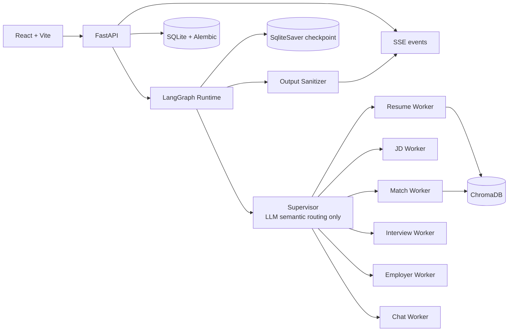

# JobPilot

> 基于 LangGraph 多智能体的 AI 求职助手

[📺 演示视频](https://github.com/sleepycat583/JobPilot/releases/tag/v0.1.0) | [📖 架构文档](docs/langgraph-architecture.md) | [🚀 快速开始](#快速开始)

---

## 功能特性

- **简历解析与向量索引**：自动提取 PDF/DOCX/TXT，生成结构化简历，通过 ChromaDB 索引支持证据检索
- **JD 分析与匹配评分**：解析职位描述，基于向量检索提供匹配分数和证据引用
- **模拟面试与逐题反馈**：根据简历和 JD 生成面试题，提交回答后获得实时评估和改进建议
- **雇主背调**：集成企查查 API，查询企业工商信息和风险提示
- **HITL 中断流程**：匹配低分确认、雇主主体多候选确认，用户决策后恢复执行
- **状态持久化与恢复**：SqliteSaver checkpoint + SSE 断点续传，刷新页面或网络中断后自动恢复

## 演示视频

> **完整流程演示**：简历解析 → JD 分析 → 匹配评分 → 模拟面试 → 雇主背调


https://github.com/user-attachments/assets/69d5c504-17f4-4d9a-b4fb-f2c79bd1fa64


[📥 下载视频](https://github.com/sleepycat583/JobPilot/releases/download/v0.1.0/Video.Project.1.mp4)

**核心亮点**：
- ✅ LangGraph Supervisor-Worker 多智能体架构（6 个专职 Worker）
- ✅ HITL 中断流程（匹配低分确认 + 雇主主体多候选确认）
- ✅ SqliteSaver checkpoint + SSE 断点续传
- ✅ ChromaDB 向量检索 + Pydantic 结构化输出

**量化指标**：
- 后端测试：**96 passed, 0 failed**（100% 通过率）
- 核心业务流程：**5/5 通过**（简历/JD/匹配/面试/背调）
- Supervisor 路由：**30/30 通过**（100% 准确率）
- 代码规模：Python 3300 行 + TypeScript 400 行

## 系统架构



Supervisor 只负责语义路由，Worker 执行业务动作，Output Sanitizer 是唯一用户可见输出出口。

## 技术实现

**Supervisor-Worker 编排**：基于 LangGraph 官方 `create_supervisor()` 构建 Supervisor，通过结构化输出调用 `transfer_to_*` 工具选择 Worker。Supervisor 只做语义路由，不执行业务逻辑。字段所有权隔离防止 Worker 互相覆盖状态。

**HITL 中断机制**：匹配分数低于阈值或雇主背调返回多候选时，利用 LangGraph 的 interrupt 机制暂停执行，状态持久化在 SqliteSaver。前端通过 SSE 检测到 `pending_interrupt` 后弹出确认框，用户决策后调用 `/resume` 接口继续。

**SqliteSaver Checkpoint**：保存完整 Agent 执行状态，包括对话历史和 Worker 结果。启动时自动恢复所有 `status=running` 的任务。失败任务支持幂等重试。

**向量检索与证据引用**：简历上传后异步写入 ChromaDB（阿里云 Embedding），文本切块 1000 token/块、200 token 重叠。匹配时检索 top-5 证据片段，减少幻觉。

**SSE 断点续传**：通过 `Last-Event-ID` 支持断点续传。用户网络中断或取消任务后，刷新页面能看到之前的进度和已解析的字段。

**结构化输出校验**：所有 LLM 输出通过 `with_structured_output(Pydantic, method="function_calling")` 校验。匹配分数必须 0-100，工作年限 0-80，模型输出超范围会被拒绝。

## 技术栈

| 层 | 技术 |
|---|---|
| 前端 | React 19, Vite, React Router, TanStack Query |
| 后端 | FastAPI, SQLAlchemy, Alembic |
| 编排 | LangGraph, Supervisor-Worker |
| 状态持久化 | SQLite, SqliteSaver |
| 向量库 | ChromaDB 1.5.9 |
| 可观测性 | LangSmith |
| 本地运行时 | Python 3.11/3.12, Node.js 20+, uv, npm |

## 快速开始

### 环境要求

- Python 3.11 或 3.12
- Node.js 20+
- uv（Python 包管理器）
- npm
- OpenAI-compatible API（可选，默认 stub 模式可离线运行）

### 一键启动（Windows）

```powershell
.\scripts\local.ps1 -Action start
```

访问：
- 工作台：http://127.0.0.1:5173
- OpenAPI：http://127.0.0.1:8000/docs

日常操作：

```powershell
.\scripts\local.ps1 -Action check  # 检查服务状态
.\scripts\local.ps1 -Action stop   # 停止服务
```

### 手动启动（跨平台）

**后端**：

```bash
cd backend
cp .env.example .env
uv sync --dev
uv run python -m alembic upgrade head
uv run python -m uvicorn app.main:app --host 127.0.0.1 --port 8000
```

**前端**：

```bash
cd frontend
npm ci
npm run dev -- --host 127.0.0.1 --port 5173
```

### 启用真实 LLM

编辑 `backend/.env`：

```bash
LLM_MODE=openai
OPENAI_MODEL=gpt-4o-mini
OPENAI_API_KEY=sk-...
OPENAI_BASE_URL=https://api.openai.com/v1  # 可选
```

第三方兼容服务（Azure、通义千问、Deepseek）通过 `OPENAI_BASE_URL` 接入。

详细配置说明见 [配置文档](docs/configuration.md) 和 [本地启动指南](docs/local-quickstart.md)。

## 项目结构

```
JobPilot/
├── frontend/              # React + Vite 前端
│   ├── src/
│   │   ├── features/      # 功能模块（chat/resume/jd/match/interview/employer）
│   │   └── lib/           # API 客户端、查询钩子
├── backend/               # FastAPI + LangGraph 后端
│   ├── app/
│   │   ├── graph/         # LangGraph 构建、Worker、状态定义
│   │   ├── services/      # 业务逻辑（LLM 任务、对话动作、向量检索）
│   │   ├── api/           # FastAPI 路由
│   │   └── models/        # SQLAlchemy 模型
│   ├── scripts/           # 评估脚本、数据管理工具
│   └── tests/             # pytest 测试（96 个用例）
├── docs/                  # 文档
│   ├── langgraph-architecture.md    # LangGraph 架构设计
│   ├── local-quickstart.md          # 本地启动详细说明
│   ├── configuration.md             # 环境变量配置
│   ├── docker-deployment.md         # Docker 部署指南
│   └── data-management.md           # 数据备份与恢复
└── scripts/               # 一键启动脚本
```

完整架构说明见 [LangGraph 架构文档](docs/langgraph-architecture.md)。

## 验证

**后端测试**：

```powershell
cd backend
uv run pytest                          # 全量测试（96 个用例）
uv run python -m alembic check         # 迁移一致性检查
```

**前端验证**：

```powershell
cd frontend
npm run typecheck                      # TypeScript 类型检查
npm run build                          # 生产构建验证
```

**业务流程评估**（需要真实 LLM）：

```powershell
cd backend
uv run python scripts/evaluate_business_flows.py        # 核心业务流程
uv run python scripts/evaluate_supervisor_routes.py     # Supervisor 路由准确率
```

## 部署

- **Docker 单实例**：见 [Docker 部署指南](docs/docker-deployment.md)
- **Docker 多实例**：需要 PostgreSQL + S3 + HTTP Chroma，详见同上文档
- **数据备份**：见 [数据管理文档](docs/data-management.md)

## License

MIT © 2026 Weibin Zhang
