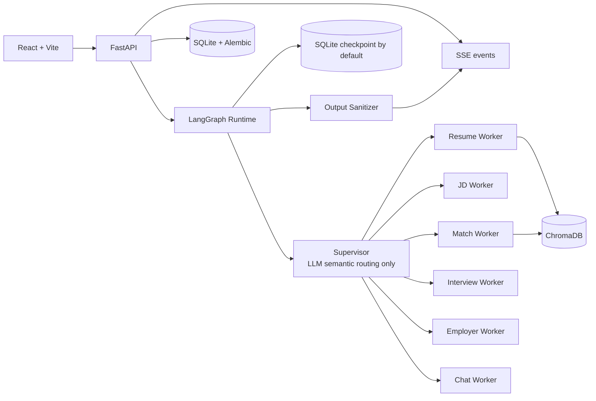

# JobPilot

> 基于 LangGraph 多智能体的 AI 求职助手

[📺 演示视频](https://github.com/sleepycat583/JobPilot/releases/tag/v0.1.0) | [📖 架构文档](backend/docs/langgraph-architecture.md) | [🚀 快速开始](#快速开始)

---

## 功能特性

- **简历解析与向量索引**：自动提取 PDF/DOCX/TXT，生成结构化简历；启用真实模型后可使用 ChromaDB 和 DashScope Embedding 建立索引、检索证据
- **JD 分析与匹配评分**：解析职位描述，基于向量检索提供匹配分数和证据引用
- **模拟面试与逐题反馈**：根据简历和 JD 生成面试题，提交回答后获得实时评估和改进建议
- **雇主背调**：集成企查查 API，查询企业工商信息和风险提示
- **HITL 中断流程**：支持匹配低分确认、雇主主体多候选确认及面试交互，用户决策后可继续执行
- **状态持久化与恢复**：SqliteSaver checkpoint + SSE 断点续传，刷新页面或网络中断后自动恢复

## 演示视频

> **完整流程演示**：简历解析 → JD 分析 → 匹配评分 → 模拟面试 → 雇主背调

https://github.com/user-attachments/assets/7c3e8e3f-9f3a-4f3e-b8f5-c6f8a7d4e1c0

[📥 下载视频](https://github.com/sleepycat583/JobPilot/releases/download/v0.1.0/Video.Project.1.mp4)

**核心亮点**：
- ✅ LangGraph Supervisor-Worker 多智能体架构（6 个专职 Worker）
- ✅ HITL 中断流程（匹配低分确认 + 雇主主体多候选确认）
- ✅ SqliteSaver checkpoint + SSE 断点续传
- ✅ ChromaDB 向量检索 + Pydantic 结构化输出

## 系统架构

下图展示默认的本地单实例配置；多实例部署可切换至 PostgreSQL、S3 和 HTTP Chroma。



Supervisor 只负责语义路由，Worker 执行业务动作，Output Sanitizer 是唯一用户可见输出出口。

## 技术实现

**Supervisor-Worker 编排**：基于 LangGraph 官方 `create_supervisor()` 构建 Supervisor，通过结构化输出调用 `transfer_to_*` 工具选择 Worker。Supervisor 只做语义路由，不执行业务逻辑。字段所有权隔离防止 Worker 互相覆盖状态。

**HITL 中断机制**：匹配分数低于阈值或雇主背调返回多候选时，利用 LangGraph 的 interrupt 机制暂停执行，状态持久化在 SqliteSaver。前端通过 SSE 检测到 `pending_interrupt` 后弹出确认框，用户决策后调用 `/resume` 接口继续。

**SqliteSaver Checkpoint**：保存完整 Agent 执行状态，包括对话历史和 Worker 结果。启动时自动恢复所有 `status=running` 的任务。失败任务支持幂等重试。

**向量检索与证据引用**：启用真实模型并配置 API 凭据后，简历会被切分并通过 DashScope `text-embedding-v4` 生成向量，写入 ChromaDB。默认切块参数为 1200 字符、重叠 180 字符；匹配时检索相关片段作为证据，减少无依据的判断。

**SSE 断点续传**：通过 `Last-Event-ID` 支持断点续传。用户网络中断或取消任务后，刷新页面能看到之前的进度和已解析的字段。

**结构化输出校验**：路由和简历、JD、匹配、面试等业务分析结果使用 Pydantic 结构化输出校验。匹配分数限制为 0–100，工作年限限制为 0–80；越界值不会作为有效结构化结果接受。

## 技术栈

| 层 | 技术 |
|---|---|
| 前端 | React 19, Vite, React Router, TanStack Query |
| 后端 | FastAPI, SQLAlchemy, Alembic |
| 编排 | LangGraph, Supervisor-Worker |
| 状态持久化 | SQLite + SqliteSaver（默认）；支持 PostgreSQL checkpoint |
| 向量库 | ChromaDB 1.5.9 |
| 可观测性 | LangSmith |
| 本地运行时 | Python 3.11/3.12, Node.js 20+, uv, npm |

## 快速开始

### 环境要求

- Python 3.11 或 3.12
- Node.js 20+
- uv（Python 包管理器）
- npm
- OpenAI-compatible 聊天模型 API（可选；默认 stub 模式无需外部模型服务，但不提供语义理解）

### 一键启动（Windows）

```powershell
.\scripts\local.ps1 -Action start
```

访问：
- 工作台：http://127.0.0.1:5173
- OpenAPI：http://127.0.0.1:8000/docs

日常操作：

```powershell
.\scripts\local.ps1 -Action check  # 检查服务状态
.\scripts\local.ps1 -Action stop   # 停止服务
```

### 手动启动（跨平台）

**后端**：

```bash
cd backend
cp .env.example .env
uv sync --dev
uv run python -m alembic upgrade head
uv run python -m uvicorn app.main:app --host 127.0.0.1 --port 8000
```

**前端**：

```bash
cd frontend
npm ci
npm run dev -- --host 127.0.0.1 --port 5173
```

### 启用真实 LLM

编辑 `backend/.env`：

```bash
LLM_MODE=openai
OPENAI_MODEL=gpt-4.1-mini
OPENAI_API_KEY=sk-...
OPENAI_BASE_URL=https://api.openai.com/v1  # 可选
```

兼容 OpenAI Chat Completions 接口的聊天模型服务可通过 `OPENAI_BASE_URL` 接入。简历向量化使用单独的 DashScope Embedding 接口，需要配置可用于该接口的 API Key；仅使用默认 stub 模式时不会创建向量库或进行真实简历向量索引。

详细配置说明见 [配置文档](docs/configuration.md) 和 [本地启动指南](docs/local-quickstart.md)。

## 项目结构

```
JobPilot/
├── frontend/
│   └── src/
│       ├── app/            # 应用级上下文
│       ├── components/     # 通用布局组件
│       ├── features/       # chat/interview/jd/match/resumes/settings
│       ├── lib/            # API 客户端
│       └── shared/         # 共享类型与 UI
├── backend/
│   ├── app/
│   │   ├── api/routes/     # FastAPI 路由
│   │   ├── core/           # 配置、checkpoint、可观测性
│   │   ├── graph/          # LangGraph 构建、Worker、状态
│   │   ├── schemas/        # API 数据契约
│   │   └── services/       # 业务逻辑与外部服务
│   ├── alembic/            # 数据库迁移
│   ├── docs/               # 架构与后端设计文档
│   ├── scripts/            # 评估、检查及数据管理脚本
│   └── tests/              # pytest 测试
├── docs/                   # 使用、配置与部署文档
├── scripts/                # 本地开发启动脚本
├── docker-compose.yml      # Docker 单实例部署
└── docker-compose.multi-instance.yml # Docker 多实例部署
```

完整架构说明见 [LangGraph 架构文档](backend/docs/langgraph-architecture.md)。

## 验证

**后端测试**：

```powershell
cd backend
uv run pytest                           # 运行后端测试
uv run python -m alembic check         # 迁移一致性检查
```

**前端验证**：

```powershell
cd frontend
npm run typecheck                      # TypeScript 类型检查
npm run build                          # 生产构建验证
```

**业务流程评估**（需要真实 LLM）：

```powershell
cd backend
uv run python scripts/evaluate_business_flows.py        # 核心业务流程
uv run python scripts/evaluate_supervisor_routes.py     # Supervisor 路由准确率
```

## 部署

Docker 单实例和多实例的完整配置、日常管理及故障排查见 [Docker 部署指南](docs/docker-deployment.md)。

- **Docker 单实例**：适合本地或单用户部署，默认使用 SQLite 和本地文件存储。准备 Docker Compose，并按需配置 `backend/.env` 后运行：

  ```powershell
  Copy-Item backend\.env.example backend\.env
  docker compose up --build
  ```

  启动后访问 <http://127.0.0.1:8080/>。如启用真实模型，在 `backend/.env` 中设置 `LLM_MODE=openai` 和 `OPENAI_API_KEY`；默认 stub 模式不需要模型 API Key，但不具备语义理解能力。
- **Docker 多实例**：需预先准备 PostgreSQL、S3 兼容存储和 HTTP Chroma，按部署指南配置后运行独立迁移任务，再启动多实例 Compose 服务。
- **数据备份**：见 [数据管理文档](docs/data-management.md)

## License

MIT © 2026 Weibin Zhang
